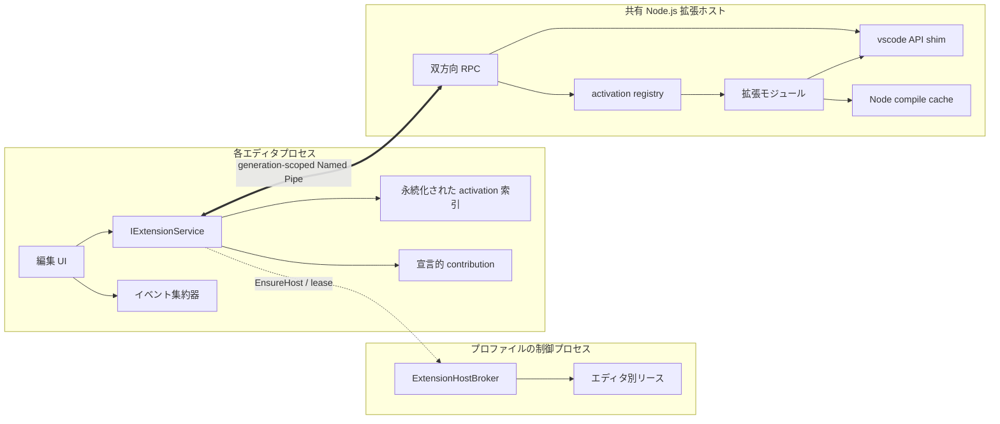
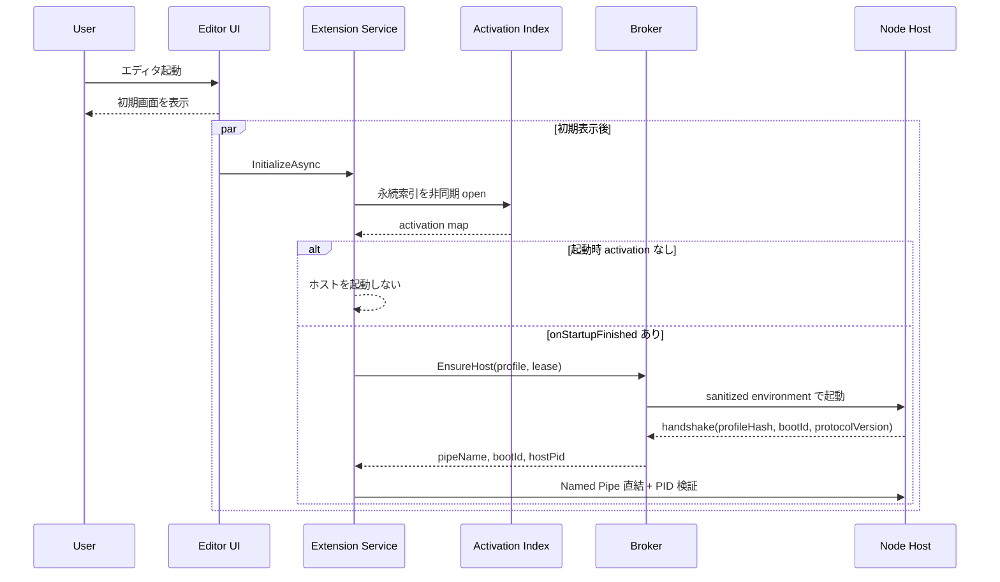
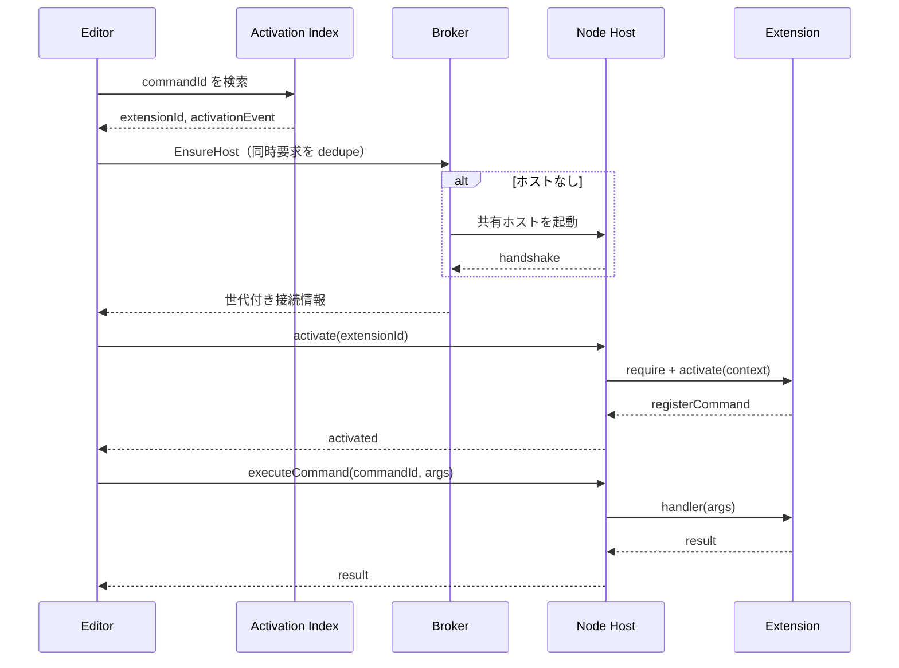
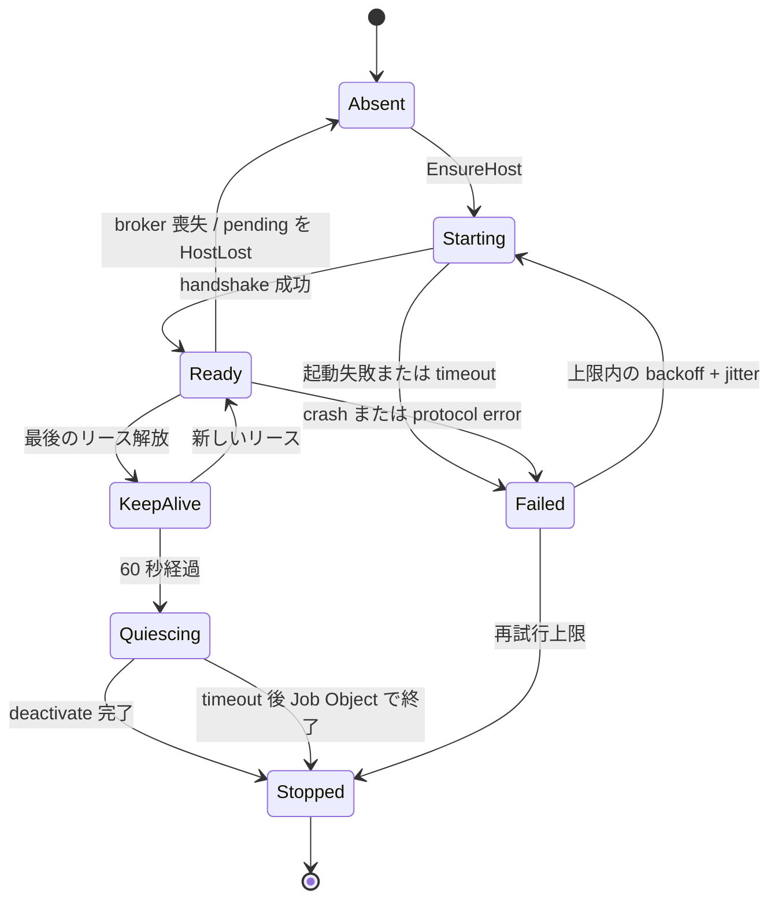
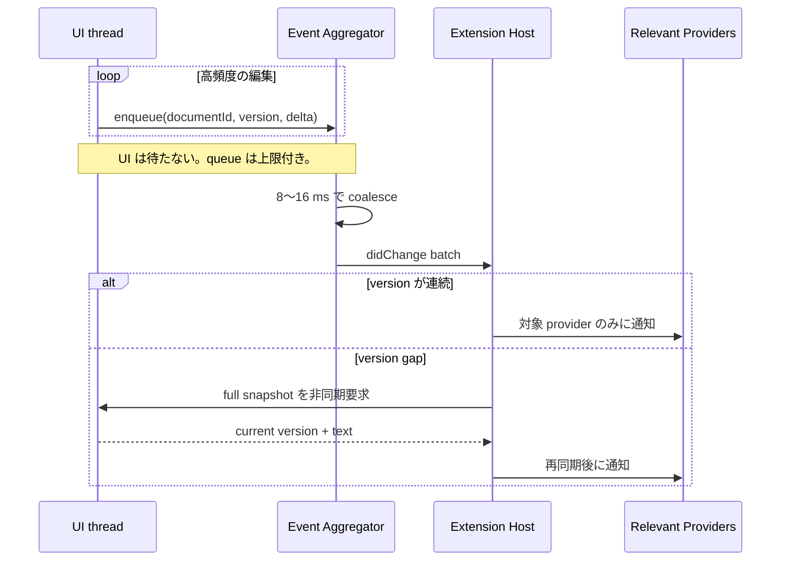
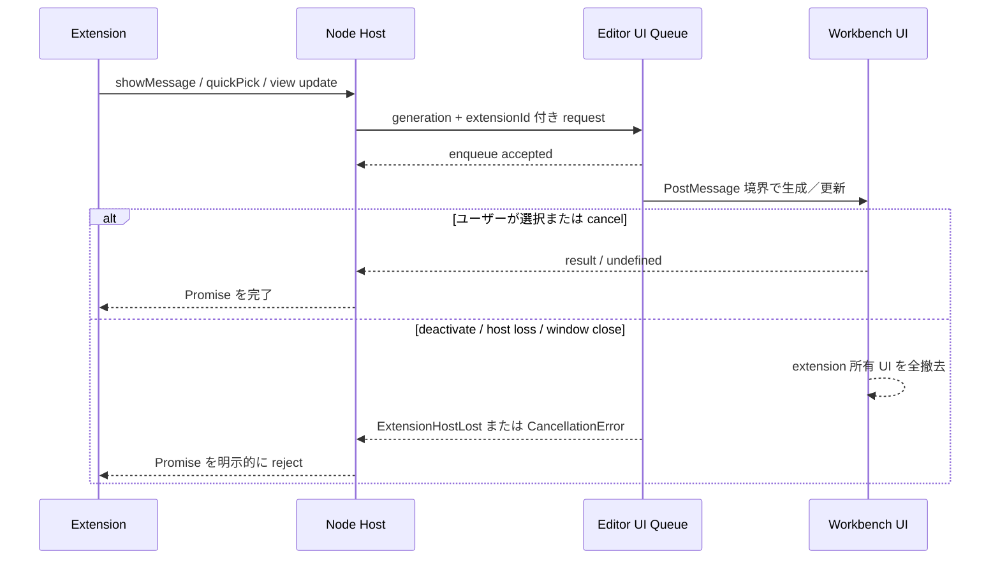

# 拡張ホスト アーキテクチャ

この文書は、Open VSX からインストールした VS Code 互換拡張を Sakura Editor NEXT で実行するための設計基準を定める。実装の追跡先は [Issue #5](https://github.com/tsuyoshi-otake/sakura-editor-next/issues/5) とする。

## 1. 目的

- エディタの初期表示を拡張機能の起動から切り離す。
- 1 プロファイルにつき 1 個の Node.js 拡張ホストを共有し、起動コストと常駐メモリを抑える。
- 必要な拡張だけを遅延 activate し、ウォーム時の代表操作を 1 回の非同期 IPC 往復にする。
- エディタ、制御プロセス、拡張ホストの責務と障害時の最終状態を明示する。
- VS Code API を段階的に実装できる、バージョン付きの双方向プロトコル境界を作る。

拡張は任意コードを実行する。プロセス分離は信頼境界を明確にし、クラッシュからエディタを守るが、拡張をサンドボックス化するものではない。

## 2. 実測と性能予算

開発機の Node.js v26.2.0 では、ウォーム状態の `node -e ""` が 47～52 ms、コアモジュール 6 個を読み込む起動が約 55 ms だった。このためホスト本体を単一 JavaScript バンドルにすれば、ウォーム起動 p95 300 ms は現実的である。一方、初回はファイルキャッシュと Windows Defender の実行時スキャンの影響が大きいため、別の予算を持つ。

| 経路 | 目標 | UI ブロック |
| --- | ---: | ---: |
| 拡張基盤によるエディタ起動追加時間 | p95 5 ms 以下 | 0 ms |
| ホスト起動（ウォーム） | p95 300 ms 以下 | なし |
| ホスト起動（初回コールド） | p95 1,500 ms 以下 | なし |
| ウォーム IPC 往復 | p95 10 ms 以下 | なし |
| `applyEdit` 受理から undo 単位確定まで | p95 16 ms 以下 | 1 フレーム以内 |
| キー入力イベント登録 | p95 0.5 ms 以下 | 0.5 ms 以下 |
| クラッシュ検出から pending request の失敗確定まで | 500 ms 以下 | なし |

性能値は環境差が大きいため CI の合否ゲートにはせず、計測値を保存してリリース確認項目にする。

再現可能な計測は、Debug build 後に次のハーネスで実行する。native probe と実 Node process／Named Pipe probe を同じ run ID にまとめ、p50、p95、サンプル数、予算判定を JSON と Markdown で `~/tmp/sakura-extension-performance` に保存する。各待機は上限付きで、実行前後に関連 process の残留がないことも検査する。

```bat
src\test\integration\run-extension-host-performance.bat -Platform x64 -Configuration Debug -Samples 30
```

コールド cohort は warm cohort より前に起動する独立した 5 個の新規 Node process である。Windows の system file cache は強制 purge しないため、マシン間比較では report の `conditions` と電源・負荷条件を併記する。`uiThreadWaitMs=0` は、計測対象の同期 startup path が worker 起動や IPC 応答を待たないという契約値である。

## 3. プロセスと依存関係



依存方向は UI／プロセス統合層から、プロトコル、索引、状態機械などの安定した抽象へ向ける。制御プロセスは起動、監視、リースだけを所有し、通常のコマンドや文書イベントを中継しない。

### 3.1 ホスト単位

- `CExtensionManager` の拡張導入先は INI と同じ階層の `extensions` であり、拡張セットはプロファイル単位である。
- ホストも制御プロセスのセッション、すなわちプロファイルごとに 1 個とする。
- 全エディタの文書を 1 個の `workspace.textDocuments` として公開する。
- `window.activeTextEditor` は最後にフォーカスを得たウィンドウの editor に切り替える。
- 初期版の `workspace.workspaceFolders` は `undefined` とし、Sakura Editor に存在しないフォルダーワークスペースを捏造しない。
- 文書 ID は `(editorProcessId, localDocId)` で名前空間化し、ホストの API シムが `Uri` に写像する。

共有ホストが暴走またはクラッシュすると全ウィンドウに影響する。このトレードオフは、起動時間とメモリを優先して受け入れる。再起動時は直前に activate した拡張を容疑候補として表示し、連続クラッシュ時はその拡張を自動無効化する。

## 4. 起動と遅延 activate

エディタの初期表示は拡張基盤を待たない。永続索引は非同期に開き、起動イベントが無ければ Node.js を起動しない。`onStartupFinished` がある場合も初期表示後にバックグラウンドで起動する。索引に `onLanguage` がある場合は、アイドル時の先行ウォームアップ候補にできる。



初回コマンドは索引を O(1) で引き、同一ホスト起動と同一拡張 activate を in-flight dedupe する。



ウォーム時には process spawn、全 manifest 走査、`require`、`activate` を行わず、エディタからホストへの 1 回の非同期 RPC 往復だけにする。

## 5. 接続とライフサイクル

ホストは multi-instance Named Pipe サーバーを 1 本持ち、各エディタがクライアント接続を 1 本張る。パイプ名は次の要素を含める。

```text
\\.\pipe\sakura-exthost-<profileHash>-<bootId>
```

- `profileHash` はプロファイルを識別するが、元のパスやユーザー情報を露出しない。
- `bootId` はホスト起動ごとに暗号学的乱数で生成する世代 ID とする。
- broker は `EnsureHost` 応答にパイプ名、`bootId`、ホスト PID を含める。
- エディタは PID と世代を検証し、古いホストまたは別プロセスへ接続しない。

broker はエディタプロセスごとのリースを参照カウントする。最後のリース解放後も 60 秒間 KeepAlive とし、短時間のウィンドウ再作成でコールド起動を繰り返さない。



再試行は回数上限、指数バックオフ、ジッターを持つ。同一世代の同時 `EnsureHost` は 1 個に dedupe し、すべての分岐を `Ready`、`Absent`、`Stopped` のいずれか、または呼び出し元から観測できる `Failed` で終了させる。

## 6. ワイヤープロトコル

### 6.1 フレーム

Named Pipe はバイトストリームとして扱い、次のフレームを連結して送る。

```text
+-------------------------------+---------------------------+
| payloadLength: uint32 BE      | payload: UTF-8 JSON       |
| 4 bytes                       | payloadLength bytes       |
+-------------------------------+---------------------------+
```

- 長さは符号なし 32 bit の big-endian とする。
- 実装上の payload 上限は 16 MiB とし、上限超過は payload を確保する前に拒否する。
- フレーム層はゼロ長 payload を復元できる。JSON-RPC 層が無効な JSON として拒否する。
- header と payload の任意位置で分割受信でき、1 回の read に複数フレームが含まれてもよい。
- 不正な長さは codec を terminal `Failed` にし、transport が接続を閉じて pending request の完了を所有する。
- decoder は各 byte を定数回だけ扱う O(N) 実装とし、入力全体の反復 erase や再走査を避ける。

### 6.2 JSON-RPC

payload は JSON-RPC 2.0 互換の Request、Response、Notification とする。接続は全二重で、エディタとホストのどちらも Request を開始できる。

- キャンセルは `$/cancelRequest` notification で伝搬する。
- request ID は接続内で一意とし、応答、失敗、切断のいずれかで必ず terminal になる。
- 未知の response ID、無効な envelope、上限超過は protocol error として接続を閉じる。
- パイプ切断、ホスト crash、broker 喪失時は全 pending request を `HostLost` で即時失敗させる。
- handshake で protocol major/minor、`profileHash`、`bootId`、ホスト PID、機能 capability を交換する。
- major 不一致は接続拒否、minor 差は capability negotiation で扱う。

## 7. 再入と UI スレッド

パイプ読取は専用スレッドで行う。read thread は frame を復元して UI queue へ積み、`PostMessage` で UI thread を起床させるだけにする。ホスト起点 Request はメッセージループ境界で処理し、`CViewCommander::HandleCommand` の実行中スタックでは処理しない。

設計上の不変条件は次のとおり。

1. エディタからホストへの呼び出しはすべて非同期で、UI thread は応答を同期待ちしない。
2. ホストからエディタへの呼び出しは UI queue を通り、メッセージループ境界でのみ実行する。
3. `showQuickPick` などの UI 要求は非同期に開き、ユーザー操作完了時に応答する。
4. マクロからの拡張コマンド同期呼び出しは初期版で拒否する。

したがって、双方が互いを同期待ちする対を作らない。

`applyEdit` は `(documentId, expectedVersion, edits[])` を取り、version 不一致なら編集せず `applied: false` を返す。成功時は既存の文書抽象を通し、独立した 1 個の undo 単位として確定する。

## 8. 高頻度イベント

キー入力ごとに全拡張へ RPC を送らない。エディタ側はイベント登録を O(1) で終え、8～16 ms の範囲で version 付き delta を集約する。



- queue は byte 数と文書数に上限を設ける。
- 上限到達時は同一文書の delta を coalesce し、表現不能なら full snapshot 要求へ縮退する。
- activation 索引から関係する provider だけへ route し、全拡張へ broadcast しない。
- cancellation と古い document version により、不要になった処理を早期終了する。

## 9. セキュリティ

### 9.1 Named Pipe

- サーバーは現在ユーザー SID のみを許可する明示的 DACL を設定する。
- 最初のサーバー作成には `FILE_FLAG_FIRST_PIPE_INSTANCE` を用いる。
- クライアントは接続後にサーバープロセス PID を取得し、broker が返した PID と一致することを確認する。
- 世代付きパイプ名と PID 検証を併用し、name squatting と旧世代への誤接続を防ぐ。

### 9.2 Node.js 起動

- 継承環境をそのまま渡さず、必要な変数だけで環境 block を構築する。
- `NODE_OPTIONS` と `NODE_PATH` は継承しない。
- `--inspect` は既定で無効とし、開発者設定で有効化した場合は起動時に明示する。
- ホストと子プロセスを Windows Job Object に入れ、終了 timeout 後の強制終了を所有する。
- 同梱 Node.js のセキュリティ更新確認をリリースチェックリストに含める。

### 9.3 拡張の信頼

- 初回 activate 前に発行者と拡張名を表示し、ユーザーの確認を 1 回だけ求める。
- 信頼判断は profile の activation 索引に永続化する。
- VSIX の hash／構造検査は改ざんや path traversal を防ぐ検査であり、発行者やコードを信頼できると判断する仕組みではない。

### 9.4 SecretStorage

- `ExtensionContext.secrets` は通常設定や `globalState` と分離する。control process が唯一の durable writer となり、Windows DPAPI の current-user scope で暗号化した Vault を canonical profile identity に束縛する。
- 保存アドレスは `(extensionId, key)` で論理的に名前空間化する。activation context から作った SecretStorage instance が canonical `extensionId` を付加し、control 側は installed inventory、host session、generation、editor lease、短命 capability を検証する。
- Editor lease の legacy window-message edge は、登録済み Sakura editor HWND と OS が返す PID の一致を control tray が process-handle取得の前後で検証する。controller は最初のleaseで `SYNCHRONIZE` handleを固定し、数値PIDを再openせず、そのprocess objectの終了で全nested leaseを回収する。owner/nestingはboundedで、rollback・final release・shutdownがhandleを一度だけ閉じる。
- 共有 Node host 内の extension は互いに別の security principal ではない。RPC の `extensionId` と installed-ID 検査は API の名前空間／適格性契約であり、悪意ある extension 間の秘密分離を保証しない。これは VS Code と同じ trusted extension-host 境界であり、強い分離には extension ごとの専用 process と認証済み起動 identity が必要になる。
- 更新は global revision CAS、同一 operation ID の bounded replay、一時ファイルへの書き込み、flush、atomic replace の順で直列化する。旧 per-editor Vault は control-owned migration coordinator だけが bounded lazy migration する。
- API は実装済みの `get`、`store`、`delete`、値を含まない `onDidChange` を提供する。`keys` は現時点では `UnsupportedCapability` として Node 内で拒否し RPC を送らない。秘密値は Settings Sync、diagnostic、Output Channel、crash report、通常 log、RPC trace、変更 event に含めない。

## 10. API 互換範囲

### 10.1 Tier 0

| 領域 | API |
| --- | --- |
| 基盤型 | `Uri`, `Position`, `Range`, `Selection`, `Disposable`, `EventEmitter`, `CancellationToken` |
| commands | `registerCommand`, `executeCommand`、Command Palette、`setContext`、`contributes.commands`／menus／when |
| window | message APIs、notification progress、`showQuickPick`、`showInputBox`、status bar、output channel、active editor event |
| workspace | documents、open/change/save/close events、`applyEdit`、configuration、filesystem |
| document/editor | text/line/offset/position、save/edit、selection(s) |
| languages | document/range formatting provider、diagnostic collection |
| context | subscriptions、revisioned global/workspace state、control-Vault-backed secrets、extension path |
| env | clipboard、app name、匿名化した machine ID |
| workbench | Activity Bar、`viewsContainers`／`views`、TreeView／TreeDataProvider、Problems／Output pane |
| webview | Webview View／Panel、CSP、navigation、local resource roots、message bridge |

diagnostics の最小 UI は行の下線と一覧 pane とする。

### 10.2 Tier 1

- completion provider
- hover provider
- `vscode-languageclient` の互換動作
- task、terminal、SCM の provider／execution API

Task の native backend は、`.vscode/tasks.json`／`.code-workspace` の
folder-scoped catalog、bounded run ownership、shell/process policy、ConPTY の
real exit code、post-quiescence completion まで実装済みである。ただし、これは
extension API 互換の完了を意味しない。`CNormalProcess` の Task factory は現時点で
presentation sink を持たず、Task 出力は native Terminal tab に投影されない。
VS Code と同じ構造へ寄せる次段では、Task と panel が共有する runtime-owned
Terminal session/model authority、provider/custom execution RPC、variable resolution、
dependency/background scheduling、problem matcher、presentation policy を実装する。
raw ANSI bytes を Output pane や HWND-local buffer に流して Terminal 互換とみなしては
ならない。

### 10.3 初期版の対象外

- debug
- grammar と theme の処理系
- マクロからの同期的な拡張コマンド実行

### 10.4 UI 所有権と非同期応答



- Command Palette は Sakura の組み込み command table と extension contribution を同じ検索 index に載せ、選択時に `onCommand:<id>` を遅延 activate する。
- status bar、notification、output、view、webview は `(generation, extensionId, resourceId)` で所有し、dispose／deactivate／crash の全分岐で terminal cleanup を行う。
- UI request は件数と byte 数を上限化する。通知連打は extension 単位で集約または拒否し、拒否理由を extension log へ記録する。
- Webview は既存の WebView2 基盤を再利用し、既定 deny の navigation、CSP、許可済み local resource root、message size 上限を適用する。

## 11. 実物拡張による受け入れ

次の Open VSX 拡張を、`install -> activate -> 代表操作 -> 期待結果` のシナリオで段階的に検証する。現行版の静的監査により、4 本すべてが当初の Tier 0 を超える API に依存すると判明したため、これらを Tier 0 完了の一括条件にはしない。詳細は [Open VSX 拡張互換性監査](./extension-compatibility-audit.md) を参照する。

| 拡張 | 代表経路 |
| --- | --- |
| `EditorConfig.EditorConfig` 0.18.2 | Tier 0.5。単一文書の保存時介入を先行検証 |
| `esbenp.prettier-vscode` 12.4.0 | Tier 1。formatting、watcher、workspace／process policy |
| `DavidAnson.vscode-markdownlint` 0.62.0 | Tier 1。diagnostics、watcher、code action、tasks |
| `streetsidesoftware.code-spell-checker` 4.6.0 | Tier 2。language client と複合 UI 実装後に再評価 |

Tier 0 の完了条件は、制御可能な最小 fixture による host lifecycle、command、document、diagnostics、cancel、host-loss の検証とする。実物拡張はバージョン更新で要求 API が変わり得るため、受け入れ fixture に version と VSIX hash を固定する。

## 12. テスト戦略

- C++ unit: frame codec、RPC envelope、host state machine、activation 索引、event aggregation。OS process なしで決定的に検証する。
- protocol integration: bounded fake host で handshake、分割／連結 frame、cancel、disconnect fail-fast、protocol error を検証する。
- host unit: Node.js の `node:test` で API shim と activation registry を検証する。
- acceptance: 固定した 4 拡張を profile 隔離環境にインストールし、代表シナリオを実行する。
- performance: p50/p95、サンプル数、cold/warm 条件を保存する。CI の時間制約にはしない。

すべての待機、再試行、process close には timeout を設ける。自動テスト後は `tests1.exe`、`sakura.exe`、Node.js host と親 runner が残っていないことを確認する。

## 13. 実装順序

1. big-endian frame codec、RPC envelope、fake host protocol test
2. broker、lease、generation、state machine、backoff、Job Object
3. document sync、event aggregation、versioned `applyEdit`、undo boundary
4. `src/exthost/` の単一 bundle と Tier-0 API shim
5. 4 拡張の受け入れ scenario と診断 UI

各段階は次の段階に依存される安定した境界と、自動テスト可能な terminal state を完成させてから進む。
