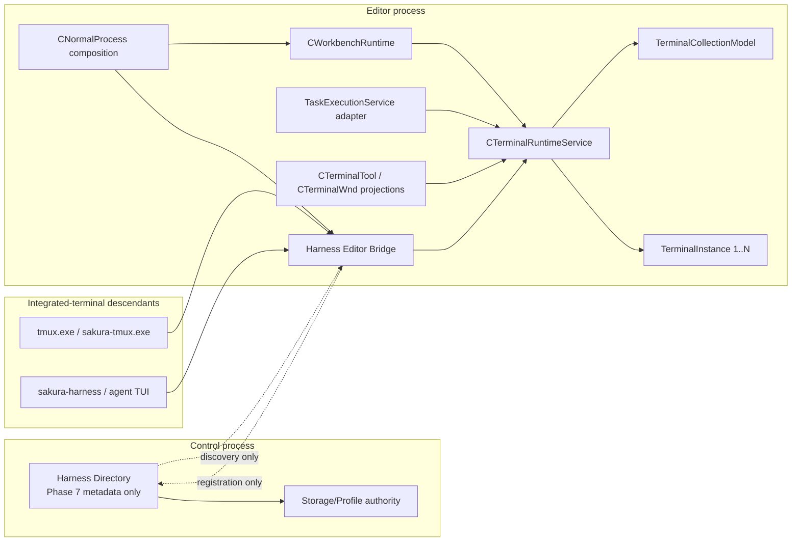
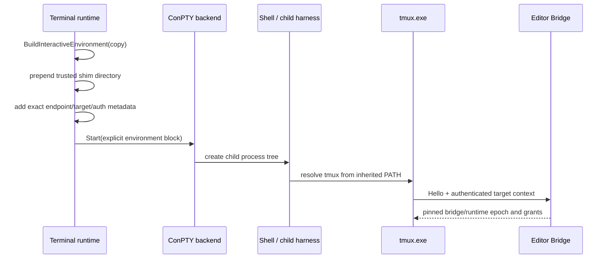
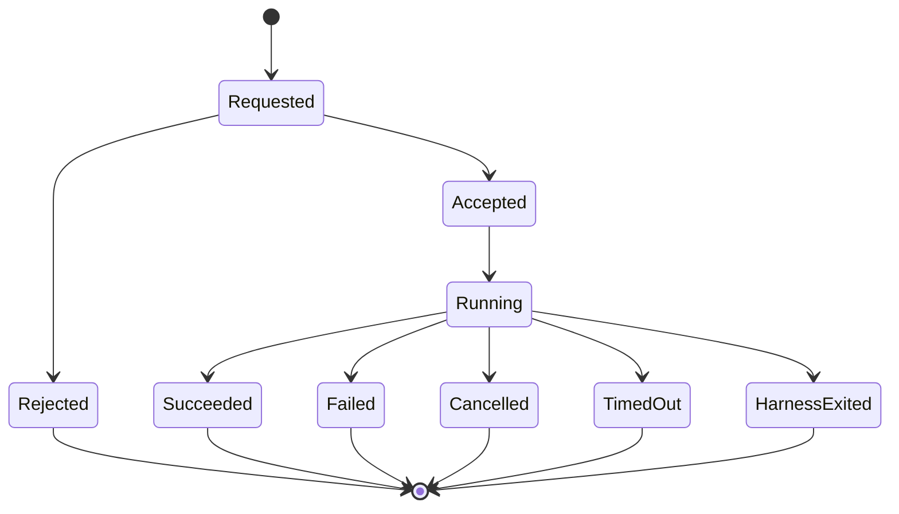
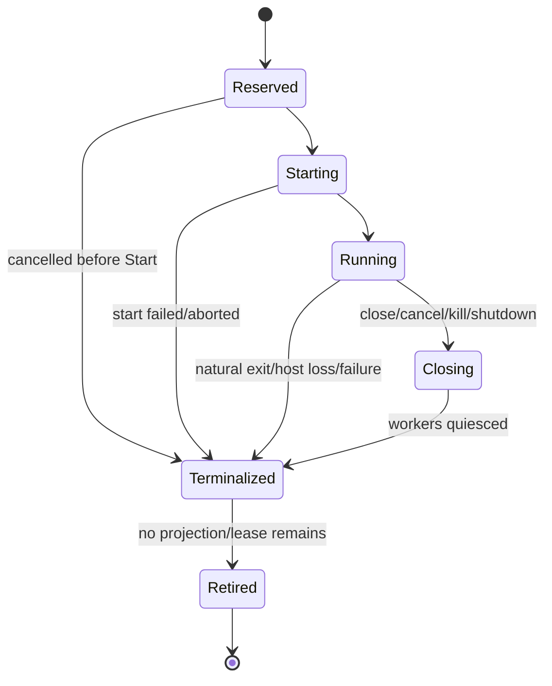

# Issue #277 tmux 互換統合ターミナル・ハーネス 基本設計

この文書は [Issue #277](https://github.com/tsuyoshi-otake/sakura-editor-next/issues/277) の基本設計を定める。コマンド、型、wire format、上限値およびテスト契約は [詳細設計](issue277-terminal-harness-detailed-design.md) を正とする。

依存矢印は一貫して `consumer -> provider/dependency` の向きで記載する。

## 1. 目的

Sakura Editor NEXT の統合ターミナル内で動く複数のエージェント・ハーネスを、既存の tmux 操作知識を使って安全にオーケストレーションできる制御面を提供する。

実現する価値は次の三点である。

1. 統合ターミナルとその子プロセスでは、フルパスなしの `tmux` で端末の列挙、入力、限定取得、構成変更ができる。
2. PTY へキーを送る tmux 互換面と、run/message の完了を型付きで扱う `sakura-harness` 面を分離する。
3. 画面ピクセル、フォーカス、HWND、legacy shared state ではなく、runtime-owned `TerminalInstance` を唯一の端末 authority とする。

本機能は upstream tmux の Windows 移植ではない。tmux 3.7c のコマンド契約から明示的に選んだ互換 subset を Sakura の ConPTY runtime へ写像する fork extension である。

## 2. 前提となる既存契約

本設計は、次の既存契約を置き換えずに拡張する。

- [`sakura_core/terminal/CLAUDE.md`](../sakura_core/terminal/CLAUDE.md) の `CTerminalSession`、bounded queue、worker quiescence、UI-thread model mutation、metadata-only diagnostics の契約。
- [`sakura_core/_main/CLAUDE.md`](../sakura_core/_main/CLAUDE.md) の Control process と editor process の所有権、および逆順 shutdown。
- [`sakura_core/platform/controlipc/CLAUDE.md`](../sakura_core/platform/controlipc/CLAUDE.md) の current-user IPC、generation fence、bounded framing、exact terminal response の設計原則。
- [`sakura_core/workbench/tasks/CLAUDE.md`](../sakura_core/workbench/tasks/CLAUDE.md) の Task run authority と terminal output authority の分離。
- repository-wide の「実際の VS Code concept を実装し、未実装 capability は fail closed する」という最優先規則。

現状では [`TerminalTabManager`](../sakura_core/terminal/window/TerminalTabManager.h) の内部 `Tab` が `CTerminalSession`、`TerminalModel`、`TerminalParser`、`SakuraTerminalInputAdapter` を所有している。Task は別の `CTaskTerminalExecutionSession` が `CTerminalSession` を所有する。Issue #277 の先頭 gate は、この二重 ownership を runtime authority へ統合することである。

## 3. 対象範囲

### 3.1 対象

- editor process が所有する interactive terminal と、同じ runtime authority へ移行した Task-origin terminal instance。
- Sakura の terminal session、terminal group、split pane、parsed model、ConPTY input path。
- `sakura-tmux.exe` と、統合ターミナル専用の `tmux.exe` shim。
- tmux-shaped target、選定した command/alias/format/exit contract。
- bounded snapshot と incremental capture cursor。
- `sakura-harness` の endpoint 登録、bounded message、ack、dedupe、run terminal outcome。
- current-user named pipe、capability grant、profile/editor/runtime generation fence。
- 同一 editor 内の control plane。cross-editor routing は同じ ID/security contract を維持した後の最終 phase とする。

### 3.2 非対象

- upstream tmux server、Unix socket protocol、configuration language、key table、hook、copy mode、paste buffer、status line、plugin、`tmux -C`。
- WSL、MSYS2、Cygwin、Windows Terminal、外部 tmux が所有する terminal の管理。
- global/user/system `PATH` の変更。
- Sakura host process、通常の外部 shell、Task process への shim directory 注入。
- prompt scraping を run completion とみなすこと、または structured message を PTY 入力へ偽装すること。
- raw PTY の無制限 subscription。
- full upstream tmux compatibility、または upstream VS Code capability であるとの表示。

## 4. 要件 ID

| ID | 要件 | 成功条件 |
|---|---|---|
| FR-01 | runtime authority | UI projection の破棄・再生成にかかわらず同じ `TerminalInstance` が生存する |
| FR-02 | scoped discovery | interactive Sakura terminal と子だけが `tmux.exe` shim を優先して発見する |
| FR-03 | stable targeting | `$session`、`@window`、`%pane` と generation を持ち、stale ID は alias しない |
| FR-04 | TUI input | named key と literal text を focus 非依存の atomic PTY input batch として送る |
| FR-05 | bounded capture | parsed model の選択範囲だけを、revision/cursor/gap/truncation 付きで取得する |
| FR-06 | honest tmux subset | 対応 command、alias、format、stdout/stderr、exit status だけを互換として提供する |
| FR-07 | structured messaging | bounded envelope、ack、dedupe、deadline と run の exactly-one terminal result を提供する |
| FR-08 | isolated Harness Bridge | Control Storage/Profile RPC と別の protocol、endpoint、grant、lifecycle を使う |
| FR-09 | owned shutdown | accept 停止、I/O cancel、pending terminalize、worker join、endpoint 撤去を完了する |
| NFR-01 | bounded resource | frame、capture、queue、session、wait、retry、concurrency をすべて上限付きにする |
| NFR-02 | confidentiality | terminal/message/capability 内容を trace、argv、endpoint、diagnostic に記録しない |
| NFR-03 | responsiveness | PTY I/O と pipe I/O で UI thread を待たせず、model access の UI slice を制限する |
| NFR-04 | no hidden retry | input の曖昧な再送をせず、read-only retry も回数と deadline を制限する |
| NFR-05 | genuine concepts | TerminalInstance、Group、Pane、Task、Control authority の境界を混同しない |

## 5. 概念モデル

### 5.1 tmux と Sakura の対応

| tmux concept | Sakura authority | identity |
|---|---|---|
| server | profile 内の editor bridge 群から成る logical broker | profile ID + broker epoch |
| session | editor/workspace-scoped terminal collection | `$<session-id>` |
| window | terminal group | `@<window-id>` |
| pane | group の split leaf が参照する `TerminalInstance` | `%<pane-id>` |
| client | UI projection または CLI/harness connection | connection/lease ID |

`session`、`window`、`pane` の表示名や index は identity ではない。ID は runtime generation 内で単調増加し、削除後に再利用しない。wire 上の完全な座標は profile/broker/editor/runtime generation を含むため、別 process generation の同じ数値へ誤配送しない。

### 5.2 VS Code concept との関係

- `TerminalInstance` は PTY/process/model/input を所有する runtime object であり、HWND ではない。
- terminal group は instance の順序と split tree を所有する logical model であり、Panel Part ではない。
- `CTerminalTool` と `CTerminalWnd` は Panel 内の projection である。
- Panel の hide/deactivate、renderer の device recovery、HWND の再生成は instance lifecycle event ではない。
- pane の明示的な close、`kill-pane`、workspace policy、runtime shutdown は logical close であり、instance lifecycle event である。

tmux facade、structured harness plane、recursive split は Sakura の fork extension である。設定を追加する場合は `sakura.terminalHarness.*` namespace を使い、VS Code が所有しない意味を `terminal.integrated.*` に置かない。

## 6. システム構成

### 6.1 `CTerminalRuntimeService`

Editor process 内の唯一の terminal authority とし、`CWorkbenchRuntime` が所有する。

- `TerminalInstance` の予約、起動、input、resize、drain、close、completion を所有する。
- terminal collection、group、split leaf、active identity の logical state を所有する。
- interactive-origin と task-origin を同じ lifecycle contract で扱う。
- `TerminalModel` と `TerminalParser` の mutation を editor UI executor に直列化する。
- renderer がなくても output を drain し、bounded PTY queue の進行を維持する。
- immutable snapshot、capture cursor、change journal を提供する。
- HWND、GDI、Panel Part、pipe、CLI parser には依存しない。

### 6.2 `TerminalInstance`

一つの instance は次を一体として所有する。

- `CTerminalSession` と `ITerminalBackend`。
- `TerminalModel`、`TerminalParser`、`SakuraTerminalInputAdapter`。
- launch origin、workspace/collection identity、process metadata。
- pending protocol reply と atomic input queue result。
- content revision、capture journal、presentation metadata。
- exactly-once `TerminalInstanceOutcome`。

Task の run outcome は `TaskExecutionService` が所有し、terminal process outcome は `CTerminalRuntimeService` が所有する。Task adapter は両者を対応付けるが二重 terminalize しない。

### 6.3 `TerminalCollectionModel`

Logical session/window/pane topology を UI から分離する。

- session は editor/workspace-scoped collection である。
- window は terminal group である。
- pane は split leaf と instance ID の結合である。
- split 比率、orientation、active pane、order を HWND-free state として持つ。
- `CTerminalTool` は snapshot を geometry/HWND に投影し、user action を typed command として service へ戻す。

この所有変更により、hidden Panel への `split-window`、非 focus pane への `send-keys`、projection 再生成後の stable target が同じ authority で処理できる。

### 6.4 Harness Editor Bridge

Real editor process のみが所有する terminal data-plane endpoint である。

- 別 magic/version/kind/status を持つ Harness Bridge protocol を受け付ける。
- current-user ACL、remote rejection、OS-observed PID、profile/editor/runtime epoch、capability を検証する。
- pipe worker から runtime UI executor へ bounded request を enqueue する。
- runtime が作った immutable DTO だけを worker 側で encode する。
- terminal content を durable storage、Control IPC、legacy `CShareData` に渡さない。
- forward-only editor process と Control process は terminal bridge を起動しない。

### 6.5 Profile Harness Directory

Cross-editor routing を追加する Phase 7 だけで導入する metadata-plane authority である。

- profile 内の live editor bridge descriptor と lease を列挙する。
- terminal command、PTY bytes、capture text、message payload を中継・保存しない。
- Control process の profile lifetime を借りるが、Storage/Profile RPC wire contract へ追加しない。
- client は directory で editor を解決した後、対象 editor bridge へ直接接続する。

同一 editor MVP は terminal child environment に渡された exact editor endpoint を使い、directory scan を行わない。

### 6.6 CLI

`sakura-tmux.exe` は tmux-compatible argv を typed request へ変換する canonical client である。`tmux.exe` は同じ CLI library を使う薄い entry point とし、shell command string の再構成や別 executable の PATH search を行わない。

`sakura-harness.exe` は structured message/run API の client である。custom operation を tmux command として広告しない。

## 7. 主要フロー

### 7.1 scoped command discovery

環境構築は child 用 copy に対して行い、Sakura host process の environment を変更しない。Task launch policy は別の environment policy を使い、shim directory と capability を受け取らない。

### 7.2 `send-keys`

1. CLI は argv の境界を保ったまま literal/named key token を parse する。
2. bridge は target、generation、`sendInput` grant、deadline、batch limit を検証する。
3. runtime UI executor は対象 instance の terminal modes を一度 snapshot する。
4. 全 token を一つの byte vector へ encode し、一回の bounded `QueueInput` で受理する。
5. `Accepted`、`TargetMissing`、`NotRunning`、`QueueFull`、`Denied`、`BrokerStopped`、`Ambiguous` のいずれかで terminalize する。

`Accepted` は PTY delivery queue が受理したことだけを意味し、TUI の理解や job completion を意味しない。response loss 後に input を自動再送しない。

### 7.3 `capture-pane`

1. bridge worker は request を検証し、runtime UI executor へ渡す。
2. UI executor は target model の revision と retained cursor floor を固定する。
3. `-S/-E`、incremental cursor、logical join を先に適用し、必要行だけを走査する。
4. line/character/encoded-byte/UI-time limit に達した時点で停止し、`truncated` を返す。
5. worker が immutable result を UTF-8 encode し、CLI は `-p` の stdout だけを出す。

stale cursor、reset、alternate-screen epoch 変更、scrollback eviction で差分が再構成できない場合は `gap=true` と `earliestCursor` を返す。CLI の通常 stdout に metadata を混ぜず、bridge typed response と optional machine-readable client mode で公開する。

### 7.4 structured run

同じ `runId` は exactly one terminal outcome を持つ。duplicate `messageId` は再配送せず、保存済み ack/result を返す。transport disconnect は run completion ではなく、owner が deadline、reconnect、harness exit の観測で terminalize する。

## 8. ライフサイクル

### 8.1 TerminalInstance

`Terminalized` は必ず typed outcome と worker quiescence evidence を持つ。start failure のように worker が存在しない branch も明示的 outcome にする。late callback は runtime generation と instance ID で fenced し、replacement instance に配信しない。

### 8.2 Bridge request

`Received -> Validated -> Authorized -> Dispatched -> Terminal` を基本とする。validation、authorization、deadline、cancel、overload、shutdown、transport loss のすべてに terminal result を定義する。accepted request は同一 `requestId` について一つだけ terminal response を公開する。

### 8.3 shutdown order

Editor process の停止順序は次で固定する。

1. Harness Bridge を `Stopping` にし、新規 connection/request を拒否する。
2. accept と active pipe I/O を cancel し、pending bridge request を terminalize する。
3. bridge worker を join し、capability/lease と endpoint を撤去する。
4. Task execution の新規受付を止め、run cancel/close を開始する。
5. terminal runtime の全 instance に `BeginClose` を fan-out する。
6. 一つの absolute deadline を共有して session/backend/worker の quiescence を待つ。
7. Task/terminal の exactly-once outcome を確定し、projection/listener を切断する。
8. workbench/editor runtime を `Stopped` にする。

callback thread は owner を destroy/self-join しない。callback は stop request のみを発行し、外部 composition owner が完了させる。

## 9. Security model

### 9.1 trust boundary

Harness Bridge は private local IPC であり、同一 Windows user を第一境界とする。ただし current-user ACL だけを cross-terminal input/read authority とみなさない。

connection は次の順序で認証する。

1. `PIPE_REJECT_REMOTE_CLIENTS` と protected/non-inheriting current-user DACL。
2. 最初の bounded frame 後に OS-observed client PID と impersonated SID を検証し、必ず `RevertToSelf` する。
3. exact bridge ID、profile ID、editor ID、bridge/runtime epoch を pin する。
4. terminal launch 時に発行した secret と challenge-response を検証する。secret 自体は wire に送らない。
5. client PID と process creation identity が、grant を持つ terminal job/process tree に属することを確認する。
6. connection lease に `message`、`readConsole`、`sendInput` の scope を別々に固定する。

Secret/capability は endpoint mapping、argv、trace、diagnostic に置かない。interactive terminal の scoped child environment でのみ子へ渡し、instance close、bridge epoch change、runtime shutdown で revoke する。Task process には発行しない。

### 9.2 grant policy

- `message`: registered harness endpoint への structured envelope に必要。
- `readConsole`: `capture-pane` と model snapshot に必要。
- `sendInput`: `send-keys` と将来の explicit input operation に必要。
- lifecycle mutation は別の `manageTerminal` scope とし、create/split/kill phase で追加する。

tmux compatibility が有効な interactive terminal には、runtime が同一 logical session に限定した明示的 grant を作る。scope は別々に評価し、cross-editor は拒否する。Phase 7 の cross-editor grant は user-visible policy と短期 lease を別途要求する。

### 9.3 content boundary

次は metadata-only trace にも記録しない。

- PTY bytes、parsed screen text、prompt、capture result。
- structured message payload、reply payload。
- title、working directory、launch executable/arguments。
- capability secret、challenge、HMAC、lease material。

記録できるのは、hashed/opaque ID、kind、byte count、duration、queue depth、revision、gap/truncation boolean、typed outcome だけである。

## 10. Resource and performance policy

| 対象 | 方針 |
|---|---|
| IPC | length prefix を allocation 前に検証し、frame/session/queued bytes/in-flight request を固定上限にする |
| capture | range 適用後に行・文字・UTF-8 bytes・UI slice・response deadline を同時に制限する |
| input | 一 command list を一 batch とし、既存 1 MiB session input limit 以下の小さい bridge limit を設ける |
| change journal | instance ごとの件数と metadata bytes の両方で ring eviction し、stale cursor を gap にする |
| messaging | recipient ごとの pending messages/bytes、hop count、TTL、dedupe window を制限する |
| retry | read-only discovery だけ bounded exponential backoff + jitter。input は自動 retry しない |
| UI | pipe wait/encode/write を行わず、model mutation/copy の budget 超過は truncation/Busy で終端する |
| shutdown | 全 subsystem が共有 absolute deadline を使い、deadline 後も owner が join/quiescence を完了する |

初期の数値は詳細設計で固定し、focused benchmark で graduation する。上限超過を silent partial success とせず、`ResourceExhausted`、`truncated`、`gap`、`Busy` のいずれかとして観測可能にする。

## 11. tmux compatibility policy

互換 baseline は upstream tmux 3.7c とする。実装時の golden contract は tag 固定の source/documentation から作り、`master` の変化を暗黙に追わない。

- canonical names と Issue #277 に列挙した aliases を使う。
- target grammar、format expansion、stdout/stderr、exit status は、対応すると宣言した組み合わせだけ exact に実装する。
- 未対応 command/flag/target/format/filter/special selector は stderr に deterministic diagnostic を出し、nonzero で終了する。
- unsupported lifecycle を別の Sakura state で近似しない。
- `tmux -V` は `sakura-tmux <version> (tmux 3.7c command subset; not upstream tmux)` の形で表示する。
- custom messaging は `sakura-harness` で公開し、upstream tmux feature に見せない。

互換 baseline 更新は、詳細設計の matrix、golden fixture、差異表を同じ変更で更新した場合だけ許可する。

## 12. 設計判断

| ID | 採用判断 | 不採用案と理由 |
|---|---|---|
| D-01 | runtime-owned `TerminalInstance` を唯一の process/model authority とする | UI tab ownership は hidden/rebuild と process lifetime を結合する |
| D-02 | logical group/split topology も runtime state とする | HWND tree ownership では headless command と stable target を実装できない |
| D-03 | tmux facade と structured messaging を分離する | prompt injection/scraping では ack、dedupe、completion を保証できない |
| D-04 | Harness Bridge は Control IPC と別 protocol/endpoint にする | Storage/Profile RPC へ terminal content と強い権限が逆流する |
| D-05 | terminal data plane は editor process が所有する | Control process は PTY/model/runtime authority を持たない |
| D-06 | cross-editor directory は metadata だけを扱う | central relay は content exposure、bandwidth、shutdown coupling を増やす |
| D-07 | exact inherited endpoint と generation を使う | profile-wide endpoint scan は stale/cross-editor 誤接続を招く |
| D-08 | shim PATH は interactive child environment だけで prepend する | global PATH mutation は外部 tmux と Task を破壊する |
| D-09 | input batch は accepted terminal result 後に自動再送しない | response loss 時の retry は TUI input を重複させる |
| D-10 | capture は parsed model と bounded delta cursor を使う | pixels/raw PTY は semantic range、wrap、context bound を満たさない |
| D-11 | capability + peer process identity + scoped grant を併用する | current-user SID だけでは cross-terminal mutation の意図を表せない |
| D-12 | first slice は list/send/capture/display に限定する | 未完成 topology mutation を互換 command として偽装しない |

## 13. 実装 sequence と graduation gate

### G0: authority extraction

- instance ID、lifecycle、output drain、Task adapter を runtime ownership へ移す。
- UI behavior を変えず、`TerminalTabManager` を compatibility projection に縮小する。
- hidden/rebuild、start/close race、late callback、runtime stop を検証する。

### G1: collection and bounded I/O contracts

- logical session/window/pane topology を runtime model へ移す。
- immutable snapshot、content revision、delta cursor、input batch を追加する。
- main/alternate screen、wrap、scrollback eviction、stale cursor を検証する。

### G2: editor Harness Bridge

- protocol、transport、security、endpoint、capability、editor runtime adapter を追加する。
- same-editor の list/read/send を typed operation として検証する。
- terminal authority が未提供の build/phase では `UnsupportedCapability` を返す。

### G3: tmux first vertical slice

- `sakura-tmux.exe`、`tmux.exe`、interactive child environment を追加する。
- `list-panes`、`send-keys`、`capture-pane`、`display-message` と aliases を追加する。
- tmux 3.7c golden CLI contract と scoped PATH test を通す。

### G4: topology mutation and synchronization

- list/create/select/split/kill/has/wait commands と supported format/filter を追加する。
- hidden projection、stale target、atomic operation、barrier cancellation を検証する。

### G5: structured orchestration

- `sakura-harness` register/list/send/receive/ack/run operations を追加する。
- 二つの harness、duplicate、cancel、timeout、harness exit を通す。

### G6: cross-editor

- profile Harness Directory、editor registration、cross-editor short lease を追加する。
- cross-profile、stale editor epoch、editor shutdown 中の route を fail closed で検証する。

各 gate は前 gate の executable checks が成功するまで次の互換 surface を広告しない。

## 14. 要件トレーサビリティ

| Issue #277 acceptance | 設計要素 | graduation gate |
|---|---|---|
| Runtime authority | FR-01、D-01、D-02、Section 8.1 | G0 |
| Scoped discovery | FR-02、D-07、D-08、Section 7.1 | G3 |
| Target mapping | FR-03、Section 5、D-02 | G1/G4 |
| TUI delivery | FR-04、Section 7.2、D-09 | G1/G3 |
| Context-bounded capture | FR-05、Section 7.3、D-10 | G1/G3 |
| Honest compatibility | FR-06、Section 11、D-12 | G3/G4 |
| Secure broker | FR-08/09、Section 8/9/10 | G2 |
| Two-harness orchestration | FR-07、Section 7.4 | G5 |
| Build and cleanup | Section 13 と詳細設計の verification matrix | 全 gate |

## 15. Verification 方針

実装時は各 gate を次の形式で証明する。

**Verify:** fake backend/unit contract、real ConPTY integration、protocol hostile-input/security、CLI golden、process cleanup を gate の対象に応じて実行する。

**Expect:** visible terminal behavior を退行させず、対応 subset は exact、未対応は nonzero、resource は bounded、すべての stateful branch は typed terminal state に到達し、test/ConPTY/broker worker が一つも残らない。

詳細な command、state、error、limit、test case は [詳細設計](issue277-terminal-harness-detailed-design.md) の verification matrix に固定する。

## 16. 残余 risk と deferred scope

- `TerminalModel` は現時点で UI-thread-owned である。authority 移行で mutex を足して worker mutation に変えるのではなく、UI executor と immutable DTO の seam を先に固定する必要がある。
- panel 非表示時も output drain が必要である。renderer timer を drain authority に残すと hidden terminal が停止するため、runtime wakeup pump の負荷を測定する。
- Task run outcome と terminal outcome の二重通知を避けるため、adapter の completion ownership を focused tests で固定する。
- Windows の process/job membership と secret inheritance は、PID recycle と child process tree を含む real-process security test が必要である。
- tmux の default format/output は release 間で変わり得る。3.7c baseline を固定し、将来更新を自動化しない。
- cross-editor routing は G6 まで未対応である。G2–G5 の client は exact editor endpoint 以外へ fallback しない。
- WSL/remote transport は trust model が異なるため、この design の named pipe ACL を広げず別 Issue とする。

未実装項目は成功扱いにせず、CLI capability matrix と typed `Unsupported` result で明示する。
