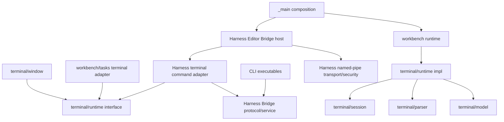
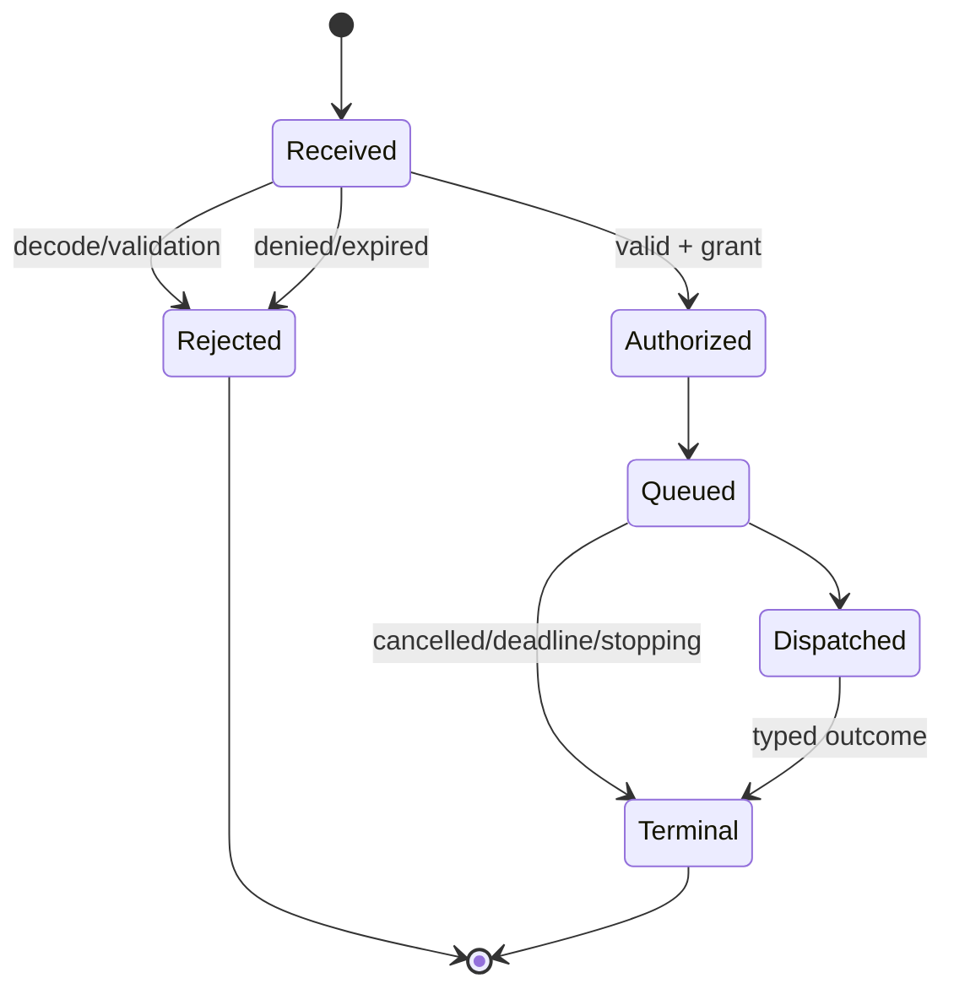

# Issue #277 tmux 互換統合ターミナル・ハーネス 詳細設計

この文書は [Issue #277](https://github.com/tsuyoshi-otake/sakura-editor-next/issues/277) と [基本設計](issue277-terminal-harness-basic-design.md) を実装可能な contract へ落とし込む。

tmux 互換 baseline は upstream tmux 3.7c とする。normative reference は tag 固定の [`tmux.1`](https://github.com/tmux/tmux/blob/3.7c/tmux.1)、[`cmd-send-keys.c`](https://github.com/tmux/tmux/blob/3.7c/cmd-send-keys.c)、[`cmd-capture-pane.c`](https://github.com/tmux/tmux/blob/3.7c/cmd-capture-pane.c)、[`cmd-list-panes.c`](https://github.com/tmux/tmux/blob/3.7c/cmd-list-panes.c) とする。[Advanced Use](https://github.com/tmux/tmux/wiki/Advanced-Use) と [Formats](https://github.com/tmux/tmux/wiki/Formats) は説明資料であり、変化する wiki を golden contract に使わない。将来の `master` も contract ではない。

## 1. Design invariants

実装は次を常時満たさなければならない。

1. `CTerminalRuntimeService` だけが terminal instance、parsed model、logical collection topology の mutation authority である。
2. session worker は model/parser/UI/bridge を直接変更せず、immutable event を coalesce して UI executor を起こす。
3. terminal UI と bridge は authority の consumer であり、互いを経由しない。
4. `TerminalInstanceId`、`TerminalSessionId`、`TerminalWindowId`、`TerminalPaneId` は runtime generation 内で再利用しない。
5. target resolution と operation dispatch は同一 runtime snapshot revision に対して行う。解決後に identity が変われば operation は失敗し、別 target へ fallback しない。
6. 一つの `TerminalInputBatch` は全体を encode/validate した後、一回だけ queue へ commit する。部分 enqueue しない。
7. `capture-pane` と structured capture は parsed model だけを読む。diagnostic trace、pixels、raw PTY replay を使わない。
8. bridge worker は UI thread 上で pipe wait、UTF-8 encode、named-pipe write を行わない。
9. accepted operation は一つの typed terminal result を持つ。`SendInput` の response loss は自動再送せず `Ambiguous` とする。
10. capability check は operation kind ごとに行い、same-user SID を `readConsole`/`sendInput`/`manageTerminal` grant の代用にしない。
11. endpoint、generation、profile/editor ID、PID、SID、capability、deadline のいずれかが不一致なら fail closed する。
12. terminal content、message payload、launch data、capability material は Control IPC、Storage/Profile RPC、`CShareData`、trace、diagnostic に入れない。
13. shutdown の各 branch は accept/input/output/pending request/session worker の owner と finalizer を明示し、detach しない。
14. Task-origin instance は同じ runtime lifecycle を使うが、interactive shim environment/capability を受け取らない。
15. 未対応 tmux surface は `Unsupported` で終端し、似た Sakura action へ置換しない。

## 2. Module layout and dependency direction

### 2.1 Proposed source layout

```text
sakura_core/terminal/runtime/
  TerminalRuntimeTypes.h
  ITerminalRuntimeService.h
  TerminalRuntimeService.h/.cpp
  TerminalInstance.h/.cpp
  TerminalCollectionModel.h/.cpp
  TerminalCaptureIndex.h/.cpp
  TerminalInputBatch.h/.cpp
  TerminalProjectionLease.h/.cpp

sakura_core/terminal/control/
  TmuxCommandTypes.h
  TmuxArgumentParser.h/.cpp
  TmuxTargetResolver.h/.cpp
  TmuxFormat.h/.cpp
  TmuxCommandDispatcher.h/.cpp

sakura_core/include/sakura/harnessbridge/
  HarnessBridgeProtocol.h
  HarnessBridgeTransport.h
  HarnessBridgeEndpoint.h
  HarnessBridgeSecurity.h

sakura_core/platform/harnessbridge/
  HarnessBridgeProtocol.cpp
  HarnessBridgeNamedPipeTransport.cpp
  HarnessBridgeEndpoint.cpp
  HarnessBridgeEndpointDiscoveryReader.cpp
  HarnessBridgeSecurity.cpp
  HarnessBridgeCapability.cpp
  HarnessEditorBridgeServiceHost.h/.cpp
  HarnessEditorBridgeRuntime.h/.cpp
  HarnessTerminalCommandAdapter.h/.cpp
  HarnessMessageService.h/.cpp

src/main/cli/sakura-tmux/
  SakuraTmuxMain.cpp
src/main/cli/tmux-shim/
  TmuxShimMain.cpp
src/main/cli/sakura-harness/
  SakuraHarnessMain.cpp
src/main/cli/harness-common/
  HarnessCliClient.h/.cpp
  HarnessCliOutput.h/.cpp
```

最初から Control IPC の wire 型や `CControlIpcNamedPipeServer` を include しない。bounded framing の実装が二系統で安定した後に共通化する場合だけ、protocol 名を含まない `platform/localipc` leaf を別 refactor として抽出する。Control/Harness の magic、kind、field tag、status は共通化しない。

### 2.2 Dependency graph



禁止 edge は次である。

- `terminal/runtime -> terminal/window`
- `terminal/runtime -> platform/harnessbridge`
- `platform/harnessbridge protocol -> terminal/window/session/model`
- `Control process/storage/profile -> TerminalModel/CTerminalSession`
- `CLI -> HWND/CShareData/workbench UI`

`HarnessTerminalCommandAdapter` が bridge DTO と `ITerminalRuntimeService` DTO を変換するため、protocol leaf と terminal runtime は相互依存しない。

## 3. Identity and coordinates

### 3.1 Strong types

```cpp
struct ProfileAuthorityGeneration { std::uint64_t value; };
struct EditorInstanceId { std::array<std::uint8_t, 16> value; };
struct BridgeId { std::array<std::uint8_t, 16> value; };
struct BridgeEpoch { std::uint64_t value; };
struct TerminalRuntimeGeneration { std::uint64_t value; };
struct TerminalSessionId { std::uint64_t value; };   // renders as $N
struct TerminalWindowId { std::uint64_t value; };    // renders as @N
struct TerminalPaneId { std::uint64_t value; };      // renders as %N
struct TerminalInstanceId { std::uint64_t value; };  // wire-internal
struct TerminalTopologyRevision { std::uint64_t value; };
struct TerminalContentRevision { std::uint64_t value; };
struct HarnessRequestId { std::uint64_t value; };
struct HarnessOperationId { std::array<std::uint8_t, 16> value; };
struct HarnessMessageId { std::array<std::uint8_t, 16> value; };
struct HarnessRunId { std::array<std::uint8_t, 16> value; };
```

すべての型は zero/invalid value を区別し、wire decode 時に range を検証する。表示 string を identity として parse し直す場合も prefix と canonical decimal form を要求し、leading sign、overflow、NUL、非 ASCII digit を拒否する。

### 3.2 Full target coordinate

```cpp
struct TerminalTargetCoordinate {
    std::string profileId;
    ProfileAuthorityGeneration profileGeneration;
    EditorInstanceId editorId;
    BridgeEpoch bridgeEpoch;
    TerminalRuntimeGeneration runtimeGeneration;
    TerminalSessionId sessionId;
    TerminalWindowId windowId;
    TerminalPaneId paneId;
    TerminalInstanceId instanceId;
};
```

CLI 表示は `$N`/`@N`/`%N` に短縮するが、bridge session は Hello 時に profile/editor/runtime 座標を pin しているため、request payload の短い ID が別 runtime を指すことはない。

ID counter overflow は wrap せず、runtime を `ResourceExhausted` にして新規作成だけを拒否する。既存 instance は継続する。

### 3.3 Index and name

- session/window/pane index は一つの topology revision における表示順であり、identity ではない。
- name は UTF-8 128 bytes 以下、NUL/control character 不可、同一 parent 内で重複不可とする。
- name lookup が曖昧になる prefix matching は行わず、完全一致だけを使う。
- command parse と dispatch の間に topology revision が変わった場合、ID target は再検証できるが index/name target は `TopologyChanged` で失敗させる。別 object を再解決しない。

## 4. Terminal runtime public contract

### 4.1 Service API

API の具体名は実装時に既存 naming と調整してよいが、意味論は次で固定する。

```cpp
class ITerminalRuntimeService {
public:
    virtual TerminalCreateResult CreateInstance(const TerminalCreateRequest&) = 0;
    virtual TerminalTopologyResult CreateSession(const TerminalSessionCreateRequest&) = 0;
    virtual TerminalTopologyResult CreateWindow(const TerminalWindowCreateRequest&) = 0;
    virtual TerminalTopologyResult SplitPane(const TerminalPaneSplitRequest&) = 0;
    virtual TerminalTopologyResult SelectWindow(const TerminalWindowSelectRequest&) = 0;
    virtual TerminalTopologyResult SelectPane(const TerminalPaneSelectRequest&) = 0;
    virtual TerminalTopologyResult ClosePane(const TerminalPaneCloseRequest&) = 0;
    virtual TerminalTopologyResult CloseWindow(const TerminalWindowCloseRequest&) = 0;
    virtual TerminalTopologyResult CloseSession(const TerminalSessionCloseRequest&) = 0;

    virtual TerminalInputResult QueueInputBatch(const TerminalInputBatch&) = 0;
    virtual TerminalCaptureResult Capture(const TerminalCaptureRequest&) = 0;
    virtual TerminalSnapshotResult Snapshot(const TerminalSnapshotRequest&) const = 0;
    virtual TerminalResizeResult Resize(const TerminalResizeRequest&) = 0;

    virtual TerminalSubscription Subscribe(TerminalRuntimeEventCallback) = 0;
    virtual void BeginClose() noexcept = 0;
    virtual TerminalRuntimeCloseResult WaitForClose(
        std::chrono::steady_clock::time_point absoluteDeadline) noexcept = 0;
};
```

Public DTO は HWND/HANDLE/HPCON、raw `TerminalModel*`、pipe type を含めない。UI renderer 用の borrowed access は次節の projection lease に分離する。

### 4.2 Create request

```cpp
enum class TerminalInstanceOrigin : std::uint8_t {
    Interactive,
    Task,
};

enum class TerminalChildEnvironmentPolicy : std::uint8_t {
    InteractiveWithHarnessShim,
    TaskWithoutHarnessShim,
};

struct TerminalCreateRequest {
    HarnessOperationId operationId;
    TerminalInstanceOrigin origin;
    TerminalChildEnvironmentPolicy environmentPolicy;
    TerminalSessionId sessionId;
    std::optional<TerminalWindowId> windowId;
    TerminalLaunchOptions launch;
    std::optional<std::string> taskRunId;
};
```

Authority は ID/operation record を session factory 呼び出し前に予約する。`Start` が同期 callback を発行しても record が存在する。create failure は予約 ID を再利用せず、typed `StartFailed` outcome を operation cache に残す。

### 4.3 Instance state and outcome

```cpp
enum class TerminalInstanceState {
    Reserved,
    Starting,
    Running,
    Closing,
    Terminalized,
    Retired,
};

enum class TerminalInstanceOutcomeKind {
    StartFailed,
    StartCancelled,
    Exited,
    Cancelled,
    Closed,
    ForcedClosed,
    HostLost,
    Failed,
    ShutdownDeadlineExceeded,
};

struct TerminalInstanceOutcome {
    TerminalInstanceOutcomeKind kind;
    std::optional<std::uint32_t> processExitCode;
    std::optional<std::uint32_t> platformErrorCode;
    bool backendQuiesced;
    bool readerQuiesced;
    bool writerQuiesced;
    TerminalContentRevision finalContentRevision;
};
```

`Terminalized` を publish する時点で、start failure を除き backend と worker は quiesced していなければならない。既存 `CTerminalSessionCompletionResult` は close cause と組み合わせて上記へ一度だけ変換する。`ShutdownDeadlineExceeded` でも `WaitForClose` が返る前に join を完了し、deadline 超過を worker survivor の許可にしない。

### 4.4 Projection lease

`CTerminalWnd` は UI executor 上だけで `TerminalProjectionLease` を借用する。

```cpp
class TerminalProjectionLease {
public:
    TerminalTargetCoordinate Coordinate() const;
    const TerminalModel& Model() const;               // UI executor only
    SakuraTerminalInputAdapter& InputAdapter();       // UI executor only
    TerminalProjectionSnapshot Snapshot() const;
};
```

Lease は instance record の generation と attach token を持つ。instance close は lease を直ちに dangling にせず `Terminalized` snapshot を保持し、projection detach 後に retire する。runtime stop 前に UI adapter を detach し、lease method は detached 後 `Unavailable` を返す。broker は lease/raw model pointer を取得しない。

### 4.5 Output drain pump

現行の `session worker -> PostMessage -> TerminalTabManager::DrainOutput` を次へ移す。

```text
session reader
  -> bounded CTerminalSession output queue
  -> outputAvailable(instanceId, generation)
  -> per-instance atomic notification gate
  -> process UI executor
  -> TerminalRuntimeService::DrainOutput(instanceId, 64 KiB / 4 ms)
  -> parser/model/capture-index mutation
  -> immutable TerminalRuntimeEvent
  -> UI projection and bounded observers
```

renderer が存在しなくても process UI executor は drain する。一回で既存 `kMaximumDrainBytes`/`kMaximumDrainTime` に達し output が残る場合は、同じ instance について一つだけ次の wakeup を予約する。instance 数を round-robin し、一つの high-output pane が他を starvation させない。

## 5. Terminal collection topology

### 5.1 Model

```cpp
struct TerminalPaneNode {
    TerminalPaneId paneId;
    TerminalInstanceId instanceId;
};

struct TerminalSplitNode {
    TerminalPaneOrientation orientation; // Horizontal or Vertical
    std::uint16_t firstWeight;
    std::uint16_t secondWeight;
    std::unique_ptr<TerminalLayoutNode> first;
    std::unique_ptr<TerminalLayoutNode> second;
};

struct TerminalWindowRecord {
    TerminalWindowId id;
    std::string name;
    TerminalLayoutNode root;
    TerminalPaneId activePane;
};

struct TerminalSessionRecord {
    TerminalSessionId id;
    std::string name;
    std::vector<TerminalWindowId> order;
    TerminalWindowId activeWindow;
};
```

weight は normalized positive integer とし、0 を拒否する。geometry pixel は model に保存しない。`CTerminalTool` が content rectangle と DPI から既存 layout algorithm で pixel bounds を計算する。

### 5.2 Topology transaction

一つの create/split/select/kill operation は UI executor 上の一 transaction とする。

1. operation ID dedupe と deadline を確認する。
2. expected topology revision と target identity を検証する。
3. replacement topology を value object として構築し invariant を検査する。
4. instance create/close intent を予約する。
5. topology を一度だけ swap し revision を increment する。
6. event snapshot を publish する。
7. async start/close を進め、最終 operation result を cache する。

start が失敗した場合、`new-window`/`split-window` は空の fake pane を残さない。reserved node を rollback し、revision を再度進め、operation を failure で terminalize する。kill は topology から先に detach した後、instance close を owner が完了する。close 中 pane ID は再利用しない。

### 5.3 Session behavior

- runtime start 時に default session/window/pane は terminal の lazy-start policyに従って予約する。
- session は一 editor/workspace runtime 内に複数持てるが、G3 UI は current session だけを投影する。
- `new-session -d` は detached logical session を作る。非 detached attach semantics は client switching が実装されるまで unsupported とする。
- workspace switch は Task受付停止 -> task-origin close -> interactive session close -> new workspace session reservation の順とする。
- session name の default は runtime-local monotonic decimal。workspace path/title を identity/diagnostic に使わない。

## 6. Target grammar and resolution

### 6.1 Supported grammar

```ebnf
target-session = session-id | session-name | session-index ;
target-window  = window-id | window-name | window-index ;
target-pane    = pane-id | pane-index ;

session-target = target-session ;
window-target  = [ target-session ] ":" target-window ;
pane-target    = pane-id
               | [ target-session ] ":" target-window [ "." target-pane ] ;
```

`$N`、`@N`、`%N` は stable identity、prefix のない decimal は index、その他は exact name とする。CLI の containing target がある場合は省略部分を current coordinate で補う。

次は実装を宣言するまで parser error とする。

- `{last}`、`{next}`、`!`、`^`、`$`、`+N`、`-N` 等の special target。
- prefix/fuzzy name matching。
- cross-editor selector。
- shell expansion、environment expansion、format expansion を target parse より前に行うこと。

### 6.2 Resolution algorithm

1. bridge Hello で pin した current coordinate と runtime generation を得る。
2. command kind から session/window/pane の必要 level を決める。
3. target string を syntax tree へ parse し、topology snapshot revision `R` を読む。
4. stable ID は exact lookup、index/name は parent scope 内 exact lookupする。
5. ID と instance generation を `ResolvedTarget` に copy する。
6. dispatch 直前に topology revision と record identity を再確認する。
7. `R` が変わり index/name target だった場合は `TopologyChanged`。stable ID target は同じ record が存在する場合だけ続行する。

省略 target は containing pane を指す。containing pane が既に閉じている場合、active pane へ fallback せず `TargetMissing` とする。

## 7. Atomic terminal input

### 7.1 Request model

```cpp
enum class TerminalInputActionKind {
    LiteralText,
    NamedKey,
    PasteText,
};

struct TerminalInputAction {
    TerminalInputActionKind kind;
    std::u16string text;
    TerminalNamedKey key;
};

struct TerminalInputBatch {
    HarnessOperationId operationId;
    TerminalTargetCoordinate target;
    std::vector<TerminalInputAction> actions;
    std::uint16_t repeatCount;
    std::chrono::steady_clock::time_point deadline;
};
```

`LiteralText` は terminal input encoding へ変換する。`PasteText` だけが `TerminalModes::bracketedPaste` の snapshot に応じて `ESC[200~`/`ESC[201~` を付ける。tmux `send-keys -l` は upstream semantics に合わせて `LiteralText` とし、bracket marker を勝手に付けない。structured `sakura-harness send-input --paste` が `PasteText` を使う。

### 7.2 Named key subset

G3 は次を exact name、case-sensitive で受け付ける。

- `Enter`, `Escape`, `Tab`, `BSpace`, `Space`
- `Up`, `Down`, `Left`, `Right`, `Home`, `End`
- `PageUp`, `PageDown`, `Insert`, `Delete`
- `F1`–`F12`
- `C-a`–`C-z`, `C-@`, `C-[`, `C-\\`, `C-]`, `C-^`, `C-_`, `C-?`

encoding は hand-written byte table ではなく `SakuraTerminalInputAdapter` の key event path を使い、application cursor mode 等を batch 開始時の一つの mode snapshot に対して解決する。unknown/unsupported key が一つでもあれば全 batch を拒否する。

### 7.3 Commit algorithm

1. target/generation/grant/deadline/operation dedupe を検証する。
2. instance state と terminal modes を一回 snapshot する。
3. action count、repeat count、UTF-16 validity を検証する。
4. 全 action を temporary byte vector へ encode する。
5. bridge input limit 以下であることを確認する。
6. `CTerminalSession::QueueInput(bytes, Interactive)` を一回だけ呼ぶ。
7. typed result を completed-operation cache に保存して返す。

`QueueFull` 時に一部を送らない。hidden pane と非 active pane も同じ path を使い、focus、foreground window、`SendInput` API を参照しない。

### 7.4 Result and replay

```cpp
enum class TerminalInputResultCode {
    Accepted,
    InvalidInput,
    UnsupportedKey,
    TargetMissing,
    StaleGeneration,
    NotRunning,
    QueueFull,
    Denied,
    DeadlineExceeded,
    BrokerStopping,
    Ambiguous,
};
```

同じ `operationId` が completed cache にあれば結果を再返し、input を再 enqueue しない。in-flight duplicate は同じ completion を待つ。client は transport loss 後に新しい operation ID で自動 retry してはならない。cache retention を過ぎた operation ID の retry は `OperationUnknown` とし、再実行しない。

## 8. Bounded capture and incremental cursor

### 8.1 Read model

Capture 用の row coordinate は current model の physical row を基準とする。

```text
main screen:
  -historySize ... -1  = retained scrollback rows
   0 ... rows-1       = visible screen rows

alternate screen:
   0 ... rows-1       = alternate screen rows
   negative rows      = unavailable
```

`-S`/`-E` は inclusive range である。値 `-` は `-S` では retained history の先頭、`-E` では current screen の末尾を表す。省略時は visible screen の先頭/末尾を使う。range を current retained coordinate へ clamp する前に syntax/overflow を検証し、start > end は空成功ではなく upstream 3.7c fixture に合わせた結果とする。

`TerminalModel::IsAlternateScreen()` が true の時は current alternate screen を authority とする。main scrollback を混ぜない。alternate screen から main screen へ戻ると capture screen epoch が変わる。

### 8.2 Row extraction

各 `TerminalCell` は次の規則で text にする。

1. continuation cell は出力しない。
2. length 0 の unwritten cell は space 一つにする。
3. UTF-16 の unpaired surrogate は model invariant failure として replacement character に正規化し、diagnostic には text を含めない。
4. `-J` がない場合は各 physical row の末尾 space を tmux 3.7c fixture と同じ規則で trim し、LF を付ける。
5. `-J` がある場合、trailing spaces を保持し、`TerminalRow::wrapped` の次 row を同じ logical line へ join する。tmux 3.7c と同じく `-J` は `-T` 相当の empty-position 処理を含む。
6. stdout は UTF-8、BOM なし、LF newline とする。Windows console text mode による CRLF 変換を避ける。

`-S/-E` による physical range 選択を最初に行い、その後 `-J` で join する。range 外の row は text 化しない。

### 8.3 Revision and journal

Instance は次を保持する。

```cpp
struct TerminalCaptureCoordinates {
    TerminalRuntimeGeneration runtimeGeneration;
    TerminalInstanceId instanceId;
    std::uint64_t instanceGeneration;
    std::uint64_t screenEpoch;
    TerminalContentRevision revision;
    std::uint64_t scrollbackBaseOrdinal;
};

struct TerminalChangeRecord {
    TerminalContentRevision revision;
    std::uint64_t screenEpoch;
    std::vector<TerminalRowRange> dirtyScreenRanges;
    std::uint64_t appendedHistoryBeginOrdinal;
    std::uint64_t appendedHistoryEndOrdinal;
    std::uint64_t evictedThroughOrdinal;
    bool fullInvalidation;
};
```

`contentRevision` は parser drain、clear、resize、screen switch のうち capture-visible content が変化した transaction ごとに一回進める。title/state だけでは進めない。`TerminalDrainResult::dirtyRows` と `TerminalScrollbackChange` を record に変換し、連続 row は range に圧縮する。journal は text/cell を複製せず metadata だけを持つ。

`fullInvalidation` は reset、resize/reflow、alternate switch、journal で表現できない scroll mutation に設定する。scrollback physical row には単調増加 ordinal を割り当て、ring eviction 後も cursor gap を判定できる。

### 8.4 Cursor encoding

Bridge response の cursor は上記 coordinate を field として持つ。CLI machine mode では versioned base64url token `hc1.<payload>.<checksum>` にする。cursor は capability secret ではないが、malformed/別 instance/別 epoch token を確実に拒否するため checksum と size limit を持つ。

```cpp
struct TerminalCaptureCursor {
    std::uint8_t version;
    TerminalRuntimeGeneration runtimeGeneration;
    TerminalInstanceId instanceId;
    std::uint64_t instanceGeneration;
    std::uint64_t screenEpoch;
    TerminalContentRevision revision;
    std::uint64_t scrollbackBaseOrdinal;
};
```

### 8.5 Incremental algorithm

1. cursor の version/instance/runtime/screen epoch を検証する。
2. cursor revision が current と等しければ、empty delta と current cursor を返す。
3. cursor revision が journal floor より古い、scrollback base が evicted、または full invalidation を跨いだ場合は `gap=true` とする。
4. gap がなければ journal range を union/coalesce し、requested `-S/-E` と intersection する。
5. 現在も retained される changed rows だけを current model から text 化する。中間 frame の event replay は保証せず、「cursor 以後に変化した座標の現在値」を返す。
6. gap の場合は requested range の bounded resync snapshot を同じ response に含め、`resyncSnapshot=true`、`earliestCursor`、`nextCursor` を返す。
7. response を作った revision を `nextCursor` に固定する。

高速に変更・消去された中間 text をイベントログとして保存しない。この contract は context-efficient current-state delta であり、audit log ではない。

### 8.6 Capture request/result

```cpp
struct TerminalCaptureRequest {
    HarnessOperationId operationId;
    TerminalTargetCoordinate target;
    std::optional<std::int64_t> startLine;
    std::optional<std::int64_t> endLine;
    bool joinWrappedLines;
    std::optional<TerminalCaptureCursor> since;
    TerminalCaptureLimits limits;
    std::chrono::steady_clock::time_point deadline;
};

struct TerminalCaptureResult {
    TerminalCaptureResultCode code;
    TerminalCaptureCoordinates coordinates;
    std::vector<TerminalCapturedLine> lines;
    TerminalCaptureCursor earliestCursor;
    TerminalCaptureCursor nextCursor;
    bool alternateScreen;
    bool gap;
    bool resyncSnapshot;
    bool truncated;
    TerminalCaptureTruncationReason truncationReason;
};
```

`TerminalCapturedLine` は logical/physical row coordinate、wrapped/joined metadata と UTF-16 text を持つ immutable DTO である。UI executor は text DTO 作成まで行い、UTF-8 size estimation をしながら limit を適用する。actual UTF-8 encode と pipe write は worker が行う。

### 8.7 Time bound

UI executor は 32 physical rows ごとに monotonic clock と cancellation/deadline を確認する。soft UI budget 到達時はその場で DTO を確定して `truncated=true`、`UiBudget` とする。複数 UI turn に分けた不整合 snapshot や UI thread 上の待機を行わない。

## 9. Harness Bridge wire protocol

### 9.1 Independent wire identity

Harness Bridge は Control IPC と別 wire ABI を持つ。

| field | size | rule |
|---|---:|---|
| frame length | 4 | little-endian。prefix 自身を除く header + payload bytes |
| magic | 4 | `0x50424853`、wire bytes `SHBP`。Control IPC magic と異なる |
| major | 2 | G2 は `1` |
| minor | 2 | G2 は `0`。unknown optional fields を許す範囲だけ forward compatible |
| kind | 2 | `EHarnessBridgeFrameKind` |
| flags | 2 | request/response/event/terminal/more |
| request ID | 8 | connection 内 nonzero、response correlation |
| bridge epoch | 8 | initial Hello だけ 0。以後 pinned epoch |
| payload | bounded | protocol-specific TLV |

fixed header は 28 bytes、maximum frame は prefix を除き 1 MiB とする。decoder は prefix/header を検証するまで payload allocation を行わない。zero/oversize/malformed/unknown-required flag/invalid UTF-8 後は sticky failure とし、connection を閉じる。

Flag bits は `Request=0x0001`、`Response=0x0002`、`Event=0x0004`、`Terminal=0x0008`、`More=0x0010` とする。Request/Response/Eventは相互排他、TerminalとMoreは同時指定不可、unknown bitはprotocol errorとする。

### 9.2 Frame kinds

```cpp
enum class EHarnessBridgeFrameKind : std::uint16_t {
    Hello = 1,
    Challenge = 2,
    Authenticate = 3,
    Ready = 4,
    OperationRequest = 5,
    OperationResponse = 6,
    CancelRequest = 7,
    CancelAck = 8,
    MessageEvent = 9,
    MessageAck = 10,
    Error = 11,
};
```

`OperationRequest/Response` payload は operation kind、operation ID、timeout、typed fields を持つ。terminal content command と structured message command は operation kind namespace を分ける。

```cpp
enum class EHarnessOperationKind : std::uint16_t {
    QueryOperation   = 0x0001,

    ListSessions     = 0x0101,
    ListWindows      = 0x0102,
    ListPanes        = 0x0103,
    CreateSession    = 0x0110,
    CreateWindow     = 0x0111,
    SplitPane        = 0x0112,
    SelectWindow     = 0x0113,
    SelectPane       = 0x0114,
    ClosePane        = 0x0115,
    CloseWindow      = 0x0116,
    CloseSession     = 0x0117,
    HasSession       = 0x0118,
    SendInput        = 0x0120,
    Capture          = 0x0121,
    Display          = 0x0122,
    WaitChannel      = 0x0123,
    Resize           = 0x0124,

    RegisterEndpoint = 0x0201,
    RenewEndpoint    = 0x0202,
    ListEndpoints    = 0x0203,
    SendMessage      = 0x0210,
    ReceiveMessages  = 0x0211,
    AcknowledgeMessage = 0x0212,
    PublishRun       = 0x0220,
    WaitRun          = 0x0221,
    CancelRun        = 0x0222,
};
```

unknown operation kindはminor versionにかかわらず`UnsupportedCapability`でterminalizeし、別kindとして推測しない。

### 9.3 Session handshake

```mermaid
sequenceDiagram
    participant C as CLI client
    participant P as Pipe transport
    participant S as Bridge session
    participant A as Capability store

    C->>P: connect exact pipe
    P->>P: remote rejection + DACL/server PID
    C->>S: Hello(public descriptor, client nonce, requested scopes)
    S->>P: verify OS PID + impersonated SID; RevertToSelf
    S->>A: locate pane-bound capability record
    S-->>C: Challenge(server nonce, bridge ID/epoch)
    C->>S: Authenticate(HMAC transcript)
    S->>A: constant-time verify + process/job membership
    S-->>C: Ready(connection lease, granted scopes, limits)
```

Hello より前、または Ready より前の operation frame は protocol error で connection を閉じる。Ready 後に bridge ID/profile/editor/runtime/generation/scope を session object へ pin し、payload がそれらを上書きできないようにする。

HMAC transcript は protocol version、bridge ID/epoch、OS-observed client PID、client/server nonce、current target、requested scopes を canonical binary encoding したものとする。secret を wire に送らない。nonce は CSPRNG 128 bit 以上で connection ごとに新規発行する。

### 9.4 Field encoding

TLV は `u16 tag, u32 length, bytes` とする。

Common tagは`TerminalStatus=1`、`Diagnostic=2`、`OperationKind=3`、`OperationId=4`、`TimeoutMs=5`、`Target=6`、`Payload=7`、`CurrentTarget=8`、`Scopes=9`、`ClientNonce=10`、`ServerNonce=11`、`AuthenticationDigest=12`、`ConnectionLease=13`とする。operation-specific tagはkindごとのschema table/codeで一元管理する。tag high bit `0x8000` はunknown時rejectすべきrequired extensionを表す。

- field count、field length、total payload を decode 前後で検証する。
- required field の欠落、duplicate singleton、unknown required tag、invalid enum、noncanonical integer は reject する。
- optional unknown tag は minor-version compatibility の規則に従い無視する。
- string は strict UTF-8、NUL 不可、種類ごとの byte limit を持つ。
- ID、revision、deadline は string にせず fixed-width binary とする。
- diagnostic は machine decision に使わず、256 UTF-8 bytes 以下の content-free stable text にする。

### 9.5 Request lifecycle



一 connection 内の request ID は correlation、operation ID は dedupe/replay identity である。request ID を再利用しない。accepted operation は 0 個以上の nonterminal progress frame とちょうど一つの terminal response を持つ。G2/G3 の terminal/capture operation は progress frame を出さず、一 terminal response だけを返す。

### 9.6 Terminal statuses

```cpp
enum class EHarnessTerminalStatus : std::uint16_t {
    Succeeded,
    InvalidRequest,
    UnsupportedVersion,
    UnsupportedCapability,
    UnsupportedTmuxSurface,
    ProfileMismatch,
    EditorMismatch,
    GenerationMismatch,
    TargetMissing,
    TopologyChanged,
    NotRunning,
    AccessDenied,
    DeadlineExceeded,
    Cancelled,
    ServerStopping,
    ResourceExhausted,
    OperationUnknown,
    Conflict,
    AlreadyTerminal,
    Ambiguous,
    ProtocolError,
    InternalError,
};
```

Transport disconnect reason と operation terminal status を混同しない。response を受信できなかった mutation は server 実行有無が不明なら `Ambiguous` であり、`Failed` と断定しない。

## 10. Transport, endpoint, and security

### 10.1 Named-pipe transport

Harness 用 transport は既存 Control IPC の実装不変条件を独立実装する。

- `PIPE_REJECT_REMOTE_CLIENTS`。
- current-user-only protected/non-inheriting DACL。
- one bounded accept loop と bounded concurrent sessions。
- first bounded read 後の `GetNamedPipeClientProcessId` と impersonated SID 検証。
- client 側の server PID、pipe DACL、exact name 検証。
- per-session serial callback。別 session だけ bounded parallel。
- Stop は accept/session I/O を cancel し、worker を join する。
- callback-origin Stop は request だけ行い、外部 owner が join する。

pipe name は canonical profile hash、opaque editor ID、bridge epoch を hash した固定 prefix name とし、workspace path、title、PID、secret を直接埋め込まない。

### 10.2 Editor endpoint descriptor

```cpp
struct HarnessEditorEndpointDescriptor {
    std::uint16_t descriptorVersion;
    std::string profileId;
    ProfileAuthorityGeneration profileGeneration;
    EditorInstanceId editorId;
    BridgeId bridgeId;
    BridgeEpoch bridgeEpoch;
    TerminalRuntimeGeneration runtimeGeneration;
    HarnessBridgeLifecycle lifecycle;
    std::uint32_t serverPid;
    std::uint64_t serverProcessCreationTime;
    std::wstring pipeName;
    std::uint16_t protocolMajor;
    std::uint16_t protocolMinor;
};
```

descriptor は discovery metadata であり secret を含まない。publisher PID/creation time、safe pipe name、current-user mapping DACL、lifecycle、anti-rollback epoch を reader が検証する。MVP child は environment の exact descriptor を使い、同名別 generation や profile directory scan へ fallback しない。

### 10.3 Capability record

```cpp
enum class HarnessGrant : std::uint32_t {
    Message        = 1u << 0,
    ReadConsole    = 1u << 1,
    SendInput      = 1u << 2,
    ManageTerminal = 1u << 3,
};

struct HarnessCapabilityRecord {
    CapabilityId id;
    SecureBuffer secret;                 // 256-bit CSPRNG
    BridgeEpoch bridgeEpoch;
    TerminalRuntimeGeneration runtimeGeneration;
    TerminalSessionId sessionId;
    TerminalPaneId originPaneId;
    TerminalInstanceId originInstanceId;
    TerminalProcessIdentity processTree;
    HarnessGrantSet grants;
    std::optional<std::chrono::steady_clock::time_point> expiresAt;
    bool revoked;
};
```

Capability は interactive instance start 前に作成し、ConPTY child environment と server store のみに置く。secret memory は use 後/close 時に zeroize する。endpoint mapping、pipe name、argv、title、working directory、trace、diagnostic、Control storage に保存しない。

server は OS-observed client PID の process creation time を読み、origin terminal job/process tree membership を platform adapter で確認する。payload の自己申告 PID/parent PID は認証根拠にしない。PID が再利用された場合は creation identity mismatch で拒否する。

```cpp
struct TerminalPeerProcessIdentity {
    std::uint32_t processId;
    std::uint64_t processCreationTime;
};

enum class TerminalProcessMembership {
    Member,
    NotMember,
    Unavailable,
};
```

ConPTY backend は job `HANDLE` を公開せず、上記 identity に対する `QueryProcessMembership` seam だけを session/runtimeへ提供する。production adapterはprocess handleをquery-onlyで開き、creation timeと`IsProcessInJob`相当を確認する。fake backendは同じcontractをOS objectなしでtestできる。`Unavailable`はdenyであり、SIDだけへfallbackしない。

Challenge-response は Windows CNG の HMAC-SHA-256 を使い、256-bit secret、client/server 128-bit nonce以上、constant-time digest compareとする。新しいcrypto dependencyは導入しない。same-editor capability credentialはinstance/runtime generationにboundしてinstance terminalizationまで有効、各authenticated connection leaseは最大5分とする。長時間harnessは同じcredentialで新しいchallengeを完了し、leaseを更新する。cross-editor credentialはG6の短期leaseを別に使う。

### 10.4 Grant defaults

| origin | Message | ReadConsole | SendInput | ManageTerminal | shim environment |
|---|---:|---:|---:|---:|---:|
| interactive terminal | same session | same session | same session | G4 で same session | yes |
| Task | none | none | none | none | no |
| external same-user process | none | none | none | none | no |
| registered harness | declared endpoint scope | explicit lease | explicit lease | explicit lease | registration policy |

「same session」は runtime が作る明示的 grant scope であり、ACL の副作用ではない。cross-editor は G6 まで常に deny する。G6 は短期 lease、destination editor acceptance、user-visible policy を追加する。

### 10.5 Environment contract

Interactive child environment へ次を設定する。

| variable | content |
|---|---|
| `SAKURA_HARNESS_ENDPOINT_V1` | versioned base64url public endpoint descriptor |
| `SAKURA_TERMINAL_TARGET_V1` | exact current session/window/pane/instance coordinate |
| `SAKURA_HARNESS_CAPABILITY_V1` | capability ID + secret の opaque versioned encoding |
| `PATH` | trusted shim directory を既存 PATH の先頭へ一回だけ追加 |
| `NoDefaultCurrentDirectoryInExePath` | `1`。`cmd.exe`系のcurrent-directory executable優先を抑止 |

environment builder は parent environment の既存 `SAKURA_HARNESS_*`/`SAKURA_TERMINAL_TARGET_*` を一度削除し、runtime 値で置換する。case-insensitive duplicate を残さない。Win32 environment block は key case-insensitive sort、double-NUL termination、size validation を行い、`CreateProcessW` に明示的に渡す。

`TerminalLaunchOptions` は caller-owned `std::vector<TerminalEnvironmentEntry>` または immutable environment block を持つよう拡張する。Sakura host process の `SetEnvironmentVariable` を使わない。

Task 用 builder は上記三変数を削除し、shim directory を prepend しない。外部 PowerShell と user/system PATH は変更しない。

`NoDefaultCurrentDirectoryInExePath=1` はworkspace/current directoryの別`tmux.exe`がPATHより先に選ばれる経路を閉じるため、interactive child scopeだけに設定する。明示的な`.\\tmux.exe`とshell function/aliasはuserが指定したoverrideであり、shimはそれを偽装して横取りしない。

### 10.6 Shim installation and precedence

- package-owned absolute directory、例 `<install-root>\\terminal-tools\\` に `sakura-tmux.exe`、`tmux.exe`、`sakura-harness.exe` を置く。
- workspace、current directory、user-writable temp から shim をロードしない。
- `tmux.exe` は `SakuraTmuxCliMain` library を直接呼ぶ thin entry point とし、`sakura-tmux.exe` を PATH search/command string で再起動しない。
- terminal launch 前に canonical installed path と required files を検証する。owner decision 上 mandatory なので欠落時は `LaunchPolicyFailed/ShimUnavailable` とし、silent terminal launch をしない。
- PATH prepend は canonical path comparison で idempotent にする。
- `PATHEXT` に依存せず executable は `.exe` として配布する。shell からの `tmux` 解決は通常の Windows command discovery に委ねる。

### 10.7 Retry

- endpoint read/connect/Hello の read-only phase: 全体 deadline 内で最大 3 attempts、25/50/100 ms exponential delay、±25% jitter。
- exact pipe が absent/stale/別 PID/別 generation: scan/fallback せず terminal error。
- read-only list/capture: operation が dispatch 前と証明できる connect failureだけ retry 可。
- mutation/input: dispatch 後の transport loss は自動 retry 不可。同一 operation ID の明示的 result query だけ許す。
- `Retry-After` 相当の server delay が返る場合は caller deadline と小さい方を使い、immediate loop を作らない。

## 11. tmux-compatible CLI contract

### 11.1 Parsing rules

- executable basename が `tmux.exe` でも `sakura-tmux.exe` でも同じ parser/dispatcher を使う。
- argv は Windows の `wmain(int, wchar_t**)` から token 境界を保って受け取り、shell command string へ再結合しない。
- command は exact canonical name または表に記載した alias だけを許す。upstream の unique prefix abbreviation は G3/G4 では unsupported とする。
- option cluster、option operand、`--` の扱いは command ごとの tmux 3.7c golden fixture で固定する。
- global `-V` だけは bridge 接続なしで成功する。`-L`、`-S`、`-f`、`-C`、`-CC` 等の tmux server/global option は unsupported とする。
- command separator `;` と複数 command list は unsupported とする。一 process invocation は一 command operation である。
- output text は UTF-8/BOM なし。stdout は command data、stderr は diagnostic だけに使う。

### 11.2 Version output

`tmux -V` と `sakura-tmux -V` は次の一行を出す。

```text
sakura-tmux 0.1 (tmux 3.7c command subset; not upstream tmux)
```

`0.1` は Harness Bridge/tmux adapter の product version であり、Sakura 本体 version と独立に compatibility matrix 更新時だけ進める。upstream の `tmux 3.7c` だけを出してはならない。

### 11.3 Command matrix

「supported options」にない flag/operand/lifecycle は、その command 自体が実装済みでも nonzero `UnsupportedTmuxSurface` とする。

| Gate | canonical / alias | supported options and semantics |
|---|---|---|
| G3 | `list-panes` / `lsp` | `-t`, `-F`。current window default。G4 で `-a`, `-s`, `-f` を追加 |
| G3 | `send-keys` / `send` | `-t`, `-l`, `-N`。named key と literal token。mouse/reset/copy-mode flags は unsupported |
| G3 | `capture-pane` / `capturep` | `-p` 必須、`-t`, `-S`, `-E`, `-J`。paste-buffer mode と raw escape capture は unsupported |
| G3 | `display-message` / `display` | `-p` 必須、`-t`, `-F`, optional message format。UI status display は unsupported |
| G4 | `list-sessions` / `ls` | `-F`, `-f`。current editor runtime の logical sessions |
| G4 | `list-windows` / `lsw` | `-a`, `-t`, `-F`, `-f` |
| G4 | `new-session` / `new` | `-d` 必須、`-s`, `-c`。configured shell 一つを作成。attach/client switching と command tail は unsupported |
| G4 | `new-window` / `neww` | `-d`, `-t`, `-n`, `-c`, `-P`, `-F`。command tail は unsupported |
| G4 | `split-window` / `splitw` | `-h`/`-v`, `-d`, `-t`, `-c`, `-l`/`-p`, `-P`, `-F`。command tail は unsupported |
| G4 | `select-window` / `selectw` | `-t` exact target。last/next/previous selectors は unsupported |
| G4 | `select-pane` / `selectp` | `-t` exact target。direction/mark/input-off flags は unsupported |
| G4 | `has-session` / `has` | `-t`。存在時 0、不在時 1 |
| G4 | `kill-pane` / `killp` | `-t`。明示的 instance close と quiescence ownership |
| G4 | `kill-window` / `killw` | `-t`。全 child pane を一度ずつ close |
| G4 | `kill-session` | `-t`。全 child window/pane を一度ずつ close |
| G4 | `wait-for` / `wait` | `-S`, `-L`, `-U` のいずれかまたは wait、channel name。tmux 3.7c barrier/lock semantics |

`new-window`/`split-window` の custom command tail は Windows shell launch policy と upstream tmux shell-command contract を完全に対応付ける別 design ができるまで失敗させる。作成後に `send-keys` で操作できることを理由に、command tail を暗黙に PTY injection へ変換しない。

### 11.4 `send-keys`

- `-l` がある場合、全 operand を named-key lookup せず、argument 間に separator を追加せず連結して literal text とする。
- `-l` がない場合、exact supported key name は named key、それ以外の valid text operand は literal key sequence とする。
- `-N` は 1–100 の canonical decimal とし、batch 全体を指定回数 repeat する。overflow/0/負数は invalid request。
- action/byte limit は repeat 後に検証する。
- zero operand の upstream 3.7c behavior を golden fixture に固定する。
- `Enter` は terminal input adapter の Enter event、`C-c` は control-key event として encode する。文字列 `^C` を送らない。

### 11.5 `capture-pane`

- G3 は `-p` を必須とする。`-p` なしの upstream paste buffer は non-goal である。
- bounded result が complete の場合だけ stdout に全 text を書き exit 0 とする。
- `truncated` または `gap` のため complete capture を返せない場合、tmux CLI は partial stdout を出さず、stderr に content-free bound diagnostic を出して exit 1 とする。
- structured client は同じ result の partial lines、truncation reason、cursor、gap を JSON/typed response で利用できる。
- `-S/-E` は serialize 前に適用する。request range が server cap を超えた時に full scrollback を一度作って捨てない。

これは upstream の実質 unbounded capture との意図的な divergence であり、context/resource safety のためである。silent partial output は行わない。

### 11.6 `wait-for`

Barrier state は logical tmux server、すなわち current profile broker generation に scope する。G4 の same-editor 実装では editor bridge がその server slice を所有し、G6 で profile broker namespaceへ昇格する。terminal sessionごとの別namespaceにはしない。

```cpp
struct HarnessWaitChannel {
    std::string name;
    bool locked;
    bool woken;
    std::deque<WaiterId> waiters;
    std::deque<WaiterId> lockers;
};
```

- flag なし: `woken` ならそれをconsumeして即成功、そうでなければsignalまでbounded wait。
- `-S`: waiterがいれば全waiterをreleaseし、いなければone pending `woken`をsetする。
- `-L`: unlockedなら`locked=true`で即成功、lockedなら`lockers`末尾でFIFO waitする。
- `-U`: 未lockは失敗。lockerがいれば先頭一件をreleaseしてlockをtransferし、いなければunlockする。upstream同様connection owner checkはしない。
- disconnect/cancel/deadline/session close/bridge stop で waiter を必ず terminalize する。
- channel と waiter は固定上限。`locked=false`、waiter/lockerなし、pending `woken`をconsume済みのchannelを削除する。

### 11.7 Default output and golden source

default list/display format は code 内に別々の ad-hoc string を置かず、`TmuxCompatibilityProfile{baseline=3.7c}` が一元所有する。golden fixture は Linux 上の upstream tmux 3.7c に deterministic session/window/pane を作って採取し、次を固定する。

- default format string と punctuation/spacing。
- alias と canonical command の同一出力。
- active/dead flags。
- missing/ambiguous target diagnostic と exit status。
- empty list/capture。
- option conflict、unknown option/format。

Sakura-specific unavailable/bounded/security errorsだけは upstream に存在しないため、`sakura-tmux:` prefix と stable diagnostic code を stderr に出す。

## 12. Format and filter engine

### 12.1 Supported expansion

G3 は literal text、`##`、`#{variable}` のみを実装する。G4 で exact conditional/comparison subset と `-f` を追加する。`#()` shell command、arbitrary expression、environment lookup、option lookup は実行しない。

| scope | variables |
|---|---|
| session | `session_id`, `session_name`, `session_windows`, `session_created`, `session_activity`, `session_attached` |
| window | `window_id`, `window_index`, `window_name`, `window_active`, `window_panes`, `window_width`, `window_height`, `window_layout` |
| pane | `pane_id`, `pane_index`, `pane_active`, `pane_width`, `pane_height`, `pane_title`, `pane_current_command`, `pane_dead`, `pane_dead_status`, `history_size`, `history_limit` |

`pane_current_command` は stable launch executable stem、`pane_title` は resolved terminal title、`pane_dead_status` は observed process exit code がある場合だけ値を持つ。値を trace/diagnostic に記録しないが、authorized CLI output には含められる。

### 12.2 Grammar and safety

- format input は最大 4 KiB UTF-8、nesting depth 8、expanded result 512 KiB 以下。
- unknown variable、malformed braces、unsupported modifier/operator は format error。empty string へ黙って変換しない。
- expansion は一つの immutable topology/terminal snapshot に対して行う。
- list filter は行を format/serialize する前に評価する。
- filter evaluator は boolean、numeric/string equality/inequality、and/or/not の明示 subsetだけを持ち、regex/shell execution は G4 非対象とする。
- one item の format failure で partial list を返さず command 全体を失敗させる。

## 13. Structured harness messaging

### 13.1 CLI surface

G5 の canonical CLI は tmux namespace と分ける。

```text
sakura-harness endpoint register --name NAME --capabilities CSV
sakura-harness endpoint renew --endpoint ID
sakura-harness endpoint list [--session $N]
sakura-harness message send --to ID --type TYPE [--run RUN] [--reply-to ID] --payload-stdin
sakura-harness message receive [--cursor CURSOR] [--wait DURATION]
sakura-harness message ack --message ID
sakura-harness run publish --run ID --status STATUS [--payload-stdin]
sakura-harness run wait --run ID [--timeout DURATION]
sakura-harness run cancel --run ID
sakura-harness console capture --target TARGET [--cursor CURSOR] [--start N] [--end N] [--join]
sakura-harness input send --target TARGET [--literal TEXT | --paste-stdin]
```

Message/run payload は argv に置かず stdin または bounded file handle から読む。stdout machine output は versioned JSON Lines、stderr は content-free diagnostics とする。`console capture` は tmux CLI が隠す cursor/gap/truncation metadata を公開する。

### 13.2 Endpoint

```cpp
struct HarnessEndpointRegistration {
    HarnessEndpointId endpointId;
    std::string name;
    TerminalTargetCoordinate origin;
    std::uint32_t processId;
    std::uint64_t processCreationTime;
    HarnessCapabilitySet declaredCapabilities;
    std::chrono::steady_clock::time_point leaseExpiresAt;
};
```

endpoint ID は bridge が発行し、client 自己申告 ID を authority にしない。registration connection の PID/job membership と origin pane capability を bind する。lease は 30 秒、10 秒ごとの renew を標準とし、disconnect だけで即 HarnessExited にせず process handle/lease/run policy と合わせて判断する。

### 13.3 Message envelope

```cpp
struct HarnessMessageEnvelope {
    HarnessMessageId messageId;
    std::optional<HarnessRunId> runId;
    HarnessEndpointId sender;
    HarnessEndpointId recipient;
    std::optional<HarnessMessageId> replyTo;
    std::string type;
    std::string contentType;
    std::chrono::system_clock::time_point deadlineUtc;
    std::uint8_t hopCount;
    std::vector<std::uint8_t> payload;
};
```

Bridge は sender を authenticated endpoint で上書きし、payload の sender を信頼しない。deadline expired、recipient lease expired、scope 不足、queue full、hop limit は enqueue 前に terminal error とする。

Delivery は recipient ごとの FIFO、at-least-once until ack とする。`messageId` dedupe record に `Pending/Delivered/Acknowledged/Rejected` を保存し、duplicate send は payload を再 enqueue せず同じ status を返す。同じ ID で異なる digest/metadata が来た場合は protocol conflict で拒否する。

### 13.4 Receive and acknowledgement

- Receive は bounded long poll であり、最大 wait を超えない。
- response は cursor、messages、next cursor、gap を持つ。
- ack は authenticated recipient だけが発行できる。
- ack response loss 後の同一 operation/message ID replay は idempotent。
- slow recipient のために queue を無制限化せず、sender に `ResourceExhausted` を返す。
- automatic console capture -> message -> console capture loop を作らない。hop count と operation kind policy で再帰を拒否する。

### 13.5 Run state

```cpp
enum class HarnessRunState {
    Requested,
    Accepted,
    Running,
    Succeeded,
    Failed,
    Cancelled,
    TimedOut,
    HarnessExited,
};
```

Allowed transition は基本設計 Section 7.4 の state machine のみである。terminal state を publish した後の別 terminal state は `AlreadyTerminal` として拒否し、最初の result を保持する。deadline owner は bridge run service、business completion owner は recipient harness、process/lease loss observer は runtime adapter とし、全て同じ atomic terminalization function を通す。

Cancel は request を記録し recipient へ event を配送する。cancel request の ack は run terminalization ではない。recipient が `Cancelled` を publishするか、deadline/process loss owner が別 terminal outcome を確定する。

## 14. Profile directory and cross-editor phase

G6 でのみ profile-scoped Harness Directory を追加する。

### 14.1 Responsibility

- current profile authority generation 内の live editor endpoint descriptor と registration lease を保持する。
- editor ID、bridge ID/epoch、lifecycle、capability class、last renewal metadata だけを扱う。
- terminal target list、capture text、message payload、capability secret、launch metadata を持たない。
- directory 自身が terminal operation を dispatchしない。

### 14.2 Route

1. source editor bridge が coordinator の local capability と requested destination を検証する。
2. directory から exact destination editor descriptor を取得する。
3. destination editor bridge へ short-lived cross-editor lease request を送る。
4. destination が profile generation、source bridge identity、scope、user policy を検証して accept/reject する。
5. client/source bridge は destination bridge へ直接 data-plane connection を作る。
6. directory lease/bridge epoch が変われば connection を閉じる。

Control process は directory metadata lifetime を所有してよいが、Storage/Profile RPC kind/tag に追加せず Harness Directory protocol/endpoint を分離する。cross-editor 未実装時は same-editor bridge が directory 不在を理由に別 editor へ fallback しない。

## 15. Error and CLI exit mapping

### 15.1 tmux CLI

tmux compatibility surface は upstream と同じ単純な process status を保つ。

| result | exit | output |
|---|---:|---|
| success | 0 | command data を stdout |
| usage/unsupported/target/denied/unavailable/bounded failure | 1 | content-free diagnostic を stderr |
| ambiguous input/mutation | 1 | 「再送されていない」ことを明示する stderr diagnostic |

Windows exception/structured exception も process crash のままにせず top-level boundary で content-free internal error、exit 1 に変換する。secret を含む raw exception text を出さない。

### 15.2 `sakura-harness` CLI

| exit | meaning |
|---:|---|
| 0 | succeeded |
| 2 | invalid usage/request |
| 3 | target/endpoint/run/message not found |
| 4 | access denied |
| 5 | bridge unavailable/stopping/stale generation |
| 6 | deadline exceeded |
| 7 | resource exhausted/truncated/gap requiring resync |
| 8 | cancelled |
| 9 | ambiguous mutation/input or harness exited |
| 10 | protocol/internal error |

JSON mode は stable symbolic status も必ず含み、caller は diagnostic text を parse しない。

## 16. Initial limits and budgets

次の値を protocol major 1 の server hard cap とする。client はこれ以下の値を request できるが、引き上げられない。focused benchmark/security test で不適切と証明された場合は、Issue #277 の design/fixture と同じ変更で調整する。

| resource | initial cap |
|---|---:|
| wire frame, prefix excluded | 1 MiB |
| TLV fields per frame | 256 |
| one UTF-8 field | 64 KiB |
| concurrent pipe sessions per editor | 32 |
| queued encoded bytes per pipe session | 1 MiB |
| total queued encoded bytes per editor bridge | 8 MiB |
| in-flight operations per connection / editor | 8 / 64 |
| ordinary operation timeout default / maximum | 5 s / 30 s |
| connect + handshake budget | 2 s |
| authenticated connection lease | 5 minutes |
| CLI argv count / one argument | 256 / 64 KiB UTF-16 |
| terminal input batch | 64 KiB encoded, 256 actions, repeat 100 |
| capture physical rows | 4096 |
| capture UTF-16 code units | 262,144 |
| capture UTF-8 response text | 512 KiB |
| capture UI soft budget | 8 ms, checked every 32 rows |
| capture change journal | 4096 records and 256 KiB metadata |
| format input / nesting / expansion | 4 KiB / 8 / 512 KiB |
| completed operation cache | 4096 records or 10 minutes, earlier bound wins |
| registered endpoints per terminal session | 64 |
| one message payload | 256 KiB |
| queued messages per recipient | 128 messages and 1 MiB |
| message dedupe records | 4096 records or 10 minutes |
| message hop count | 8 |
| wait channels / total waiters | 256 / 128 |
| ordinary `wait-for` maximum wait | 5 minutes |
| endpoint name / message type | 128 / 128 UTF-8 bytes |
| content-free diagnostic | 256 UTF-8 bytes |

既存 `CTerminalSession` の output high/low water 4 MiB/2 MiB、input queue 1 MiB、drain 64 KiB/4 ms は下位 session cap として維持する。bridge input cap 64 KiB はその内側に置き、CLI 一回で session queue 全体を占有しない。

Hard cap 到達時の behavior は次で固定する。

- allocation/dispatch 前に検出できる場合は `ResourceExhausted`。
- capture は typed API で `truncated`、tmux CLI では stdout なし exit 1。
- queue full は drop-oldest せず producer failure。message dedupe/completed metadata だけは retention rule に従い oldest terminal record を evict できる。
- journal eviction は cursor `gap` で観測可能にする。
- session/worker 上限を増やす retry loop を作らない。

## 17. Complexity and dominant paths

| operation | target complexity | dominant work |
|---|---|---|
| stable ID target lookup | expected O(1) | generation/record validation |
| name/index target lookup | O(children in selected parent) | exact name/index resolution |
| list sessions/windows/panes | O(returned objects) | format/filter/UTF-8 output |
| `send-keys` | O(encoded batch bytes) | input adapter encoding + one queue copy |
| full capture | O(selected physical rows × columns) | cell-to-text conversion |
| incremental capture | O(journal records since cursor + selected changed cells) | range union + current text conversion |
| split/kill topology | O(depth or affected panes) | immutable replacement tree + instance lifecycle |
| message send/ack | O(payload bytes), expected O(1) lookup | digest/copy + recipient queue |
| shutdown | O(active connections + operations + instances) | cancellation and worker/backend join |

次の O(N) anti-pattern を禁止する。

- 一つの dirty row ごとに全 100,000 行 scrollback を snapshot する。
- capture range 適用前に全 model を string 化する。
- terminal output drain ごとに全 topology/layout を serialize する。
- target lookup のために全 profile/editor を scan する。
- slow recipient のために unbounded message/output history を保持する。

Performance graduation では small case だけでなく、100 panes、100,000 retained rows、最大 capture、32 bridge sessions の synthetic bound を測定し、serial bottleneck を記録する。

## 18. Threading, cancellation, and lock ownership

### 18.1 Owners

| thread/context | owns |
|---|---|
| editor UI executor | topology mutation、parser/model mutation、projection lease、capture DTO construction |
| `CTerminalSession` reader | backend read と bounded output publication |
| `CTerminalSession` writer | bounded input dequeue と backend write |
| terminal lifecycle/reaper | backend close/terminate/wait と worker join |
| bridge accept worker | bounded accept only |
| bridge session worker | frame decode/auth、runtime request wait、encode/write |
| message service worker | lease/deadline expiry と bounded recipient delivery。model/UI に触れない |

### 18.2 Bridge-to-runtime dispatch

```text
bridge session worker
  -> allocate bounded PendingOperation
  -> enqueue closure to UI executor
  -> wait on operation completion with monotonic deadline/cancellation

UI executor
  -> revalidate state/generation/grant token
  -> execute bounded runtime operation
  -> publish immutable result

bridge worker
  -> encode/write terminal response
```

UI executor は bridge worker の完了を待たない。bridge session mutex、capability-store mutex、message queue mutex を保持したまま UI closure を実行/待機しない。runtime callback は subscriber list を lock 外へ copy してから呼ぶ。

### 18.3 Cancellation race

- Queue 前 cancel: operation を `Cancelled` にし UI closure を enqueue しない。
- Queue 後/dispatch 前 cancel: UI closure が cancellation flag を見て mutation せず `Cancelled`。
- Mutation commit 後 cancel: mutation result を勝たせる。input を取り消したふりをしない。
- Capture loop 中 cancel/deadline:次の 32-row check で bounded partial resultを確定する。
- Response write 中 disconnect: server operation terminal record は保持し、client側は mutationなら `Ambiguous`。
- Shutdown: `ServerStopping` gate は新規 operation を拒否し、queued operation は mutation commit 前だけ cancel する。

一つの atomic compare/exchange terminalization helper が result winner を決め、cancel/deadline/completion が二重 response を作らないようにする。

### 18.4 UI executor lifetime

`CNormalProcess` composition が HWND-specific post adapter を提供してよいが、`ITerminalRuntimeExecutor` contract 自体は HWND-free とする。executor は terminal runtime と bridge より長生きする。shutdown 中に post が拒否された場合、request owner が `ServerStopping` で terminalize する。

## 19. Startup and shutdown composition

### 19.1 Editor startup

1. `CNormalProcess` が real editor process であることを確定する。forward-only process は以後を構成しない。
2. editor Control client から immutable profile ID/generation を得る。
3. `CWorkbenchRuntime` が `CTerminalRuntimeService` と UI executor binding を開始する。
4. Harness capability store と `HarnessEditorBridgeRuntime` を構築する。
5. protected endpoint mapping を `Starting` で作成する。
6. named pipe を bind/start する。
7. endpoint を `Accepting` で publish する。
8. interactive terminal creation policy を enable する。

4–7 の failure は逆順 rollback して bridge を `Stopped` にする。editor の通常編集機能は起動可能だが、owner decision 上 interactive terminal creation は `BridgeUnavailable/ShimUnavailable` で明示失敗し、shim なし terminal を silent に作らない。

### 19.2 Editor shutdown

1. bridge state を `Stopping` にし、interactive terminal create と新規 bridge request の gate を閉じる。
2. cross-editor directory registration があれば withdraw し、endpoint を `Stopping` で publish する。
3. accept と active pipe I/O を cancel し、queued/pending request を terminalize する。
4. bridge session/message worker を join し、connection lease/capability を revoke/zeroize する。
5. endpoint を `Stopped` で publish して mapping/pipe resources を close する。
6. Task execution の新規 run を止め、Task adapter から close/cancel を開始する。
7. terminal runtime の全 instance に `BeginClose` を fan-out する。
8. shared absolute deadline で session/backend/worker quiescence を待つ。
9. Task run と terminal instance の exactly-once outcome を確定する。
10. projection/listener/UI executor binding を detach し、workbench/editor runtime を停止する。

Bridge を terminal runtime より先に止めるため、shutdown 中に外部 command が新しい instance を作れない。terminal runtime は bridge stop 後も既存 Task/UI close を完了できる。

### 19.3 Instance close versus projection close

| action | projection | logical topology | TerminalInstance |
|---|---|---|---|
| Panel hide/deactivate | hidden | unchanged | continues |
| renderer/HWND rebuild | detach/reattach | unchanged | continues |
| device-loss recovery | recreate renderer | unchanged | continues |
| UI close-pane action | remove leaf | revision advances | BeginClose |
| `kill-pane` | remove leaf | revision advances | BeginClose |
| workspace reset | detach all old projections | old session closes | all scoped instances close |
| editor shutdown | detach after bridge stop | terminalizes | all instances close/join |

## 20. Migration plan and implementation touch points

### 20.1 G0: authority extraction without visible behavior change

Current [`TerminalTabManager`](../sakura_core/terminal/window/TerminalTabManager.h) API を transitional adapter として残す。

1. `Impl::Tab` の session/model/parser/input/protocol state を `TerminalInstance` へ移す。
2. `TerminalTabManager` は order、active selection、legacy forwarding、snapshot projectionだけを持つ。
3. [`CTerminalWnd`](../sakura_core/terminal/window/CTerminalWnd.h) の raw model/input bindingを generation付き projection leaseへ置換する。
4. [`CTerminalTool`](../sakura_core/terminal/window/CTerminalTool.h) は runtime service を注入され、session factory/launch resolver の default ownership を失う。
5. [`CWorkbenchRuntime`](../sakura_core/workbench/CWorkbenchRuntime.h) が service を所有し、Ready 中だけ accessor/borrowed interface を公開する。
6. [`CNormalProcess`](../sakura_core/_main/CNormalProcess.cpp) が session factory、launch policy、UI executor を一度だけ composition する。
7. [`TaskTerminalSessionFactory`](../sakura_core/workbench/tasks/TaskTerminalSessionFactory.h) を authority-backed adapter にし、Task が `CTerminalSession` を直接所有しないようにする。

### 20.2 G1: topology and bounded read/write

- 既存 [`TerminalPaneLayout`](../sakura_core/terminal/window/TerminalPaneLayout.h) から HWND-free logical split state を `terminal/runtime` へ移し、window layer に geometry projection を残す。
- `TerminalModel` に scrollback ordinal/content revision hook を追加する。rendererの dirty-row consumptionと capture journal updateを同じ drain transactionから配信し、片方が情報を奪わないようにする。
- `TerminalRenderMapping` の row extraction rule を reusable pure functionへ分離し、selection/captureで同じ grapheme/continuation handlingを使う。
- `TerminalLaunchOptions` に explicit child environment と process identity authorizer seam を追加する。

### 20.3 G2: Harness Bridge

- `sakura_core/include/sakura/harnessbridge` を UI-independent public leaf として追加する。
- `sakura_core/platform/harnessbridge` に protocol/transport/security/endpoint/host/adapter を追加する。
- Control IPC の source を直接 include/rename せず、必要な security helperの一般化は独立 changeとして行う。
- bridge start/stopを `CNormalProcess` の reverse lifecycleへ組み込む。

### 20.4 G3–G6: CLI, packaging, messaging, directory

- CLI common library と三 executable target を追加する。
- trusted shim directory を installer/ZIP/distribution manifestへ追加する。
- interactive/task environment policy を分離して focused launch testsを追加する。
- G5 message service、G6 profile directory は terminal protocol kindsと別 module/serviceで追加する。
- 実装完了時に [`sakura_core/terminal/CLAUDE.md`](../sakura_core/terminal/CLAUDE.md) へ scoped shim、runtime authority、capture/input contract、fork divergence の恒久ルールだけを追記する。詳細手順は docs/tools に残す。

### 20.5 Build metadata

- source-of-truth module metadata [`src/main/modules/modules.json`](../src/main/modules/modules.json) に acyclic module/target edgeを追加し、repositoryの generatorを使う。
- C++ sourceを含む MSBuild projectと matching `.vcxproj.filters`、CMake discoveryを確認する。
- generated `Funccode_define.h`、`Funccode_enum.h`、`version.h` は編集しない。
- CLI product/version resource、installer、ZIP assembly、license noticeを distribution buildへ含める。
- changed `.cpp/.h` は ASCII または UTF-8 BOM、resourceは BOM-marked UTF-16 の既存 encoding contractを守る。

## 21. Known divergences from tmux/VS Code

| divergence | reason | observable behavior |
|---|---|---|
| real tmux server/socketを使わない | Windows ConPTY/runtime authorityへの compatibility facade | `-V` が Sakura subsetを明示 |
| global PATHへ installしない | external tmux/WSL/MSYS2/Cygwinを侵害しない | Sakura interactive childだけ `tmux.exe` を発見 |
| interactive childはcurrent-directory exeの暗黙検索を抑止 | trusted shimをworkspace executableより優先する | 明示`.\\tool.exe`は可、Task/host環境は不変 |
| capture hard cap | context/memory/UI latencyをboundedにする | partial stdoutなし、typed truncation/exit 1 |
| input repeatとwait durationにhard cap | queue/worker/waiterをboundedにする | cap超過はResourceExhausted/timeout |
| paste buffer/copy mode/control modeなし | raw stream/buffer serverはnon-goal | relevant flags nonzero unsupported |
| `new-session` は detached subset | tmux client attach semanticsに対応するVS Code conceptがない | non-`-d`はunsupported |
| window/split custom command tailなし（初期） | Windows shell semanticsをPTY injectionで偽装しない | operandありはunsupported |
| special targets/format shell expansionなし | exact stable targetingとsecurity | parser/format error |
| sessionはeditor/workspace logical collection | Sakura runtime ownershipに写像 | cross-editorはG6 leaseが必要 |
| recursive splits | Sakura fork extension。VS Code標準のexact conceptではない | divergenceをterminal guidanceに記録 |
| structured messagesはtmux外 | upstream featureを偽装しない | `sakura-harness` namespaceのみ |

表にない divergence を実装で追加してはならない。platform constraintで新しい差異が必要なら、本書と owning subsystem guidanceを先に更新する。

## 22. Test design and graduation matrix

Test registration は [`src/test/CLAUDE.md`](../src/test/CLAUDE.md) と各 scoped test guidance に従う。agent/subagent のレビューを verification の代わりにせず、実装担当者が直接すべての Verify を実行する。

### 22.1 G0 runtime authority

| ID | Verify | Expect |
|---|---|---|
| RT-01 | fake backendでinstanceをcreate/close/recreateし旧IDへlate callbackを送る | IDは単調増加し、旧callbackはreplacementへ届かない |
| RT-02 | `Start`中の同期callback、cancel、start failure、close raceを全順序で実行する | 各recordが一つのtyped outcomeへ到達しworker survivorがない |
| RT-03 | Panel hide/deactivate、renderer destroy/recreate、device epoch changeを行う | 同じinstance/process/model revisionが継続する |
| RT-04 | rendererを一度も作らずbounded outputを流す | runtime pumpがdrainし、PTY high-waterで永久停止しない |
| RT-05 | projection leaseを保持したままinstance close/runtime stopを行う | dangling pointerなくdetach/unavailableが観測できる |
| RT-06 | Task-origin instanceのnatural exit、explicit close、cancelを実行する | Task runとterminal outcomeが二重通知されない |
| RT-07 | 100 instancesへBeginCloseし一つのabsolute deadlineで待つ | backend/reader/writer/reaperが全てquiesceしdetachがない |

Recommended focused tests:

```text
src/test/cpp/tests1/terminal/runtime/TerminalRuntimeServiceTest.cpp
src/test/cpp/tests1/terminal/runtime/TerminalInstanceLifecycleTest.cpp
src/test/cpp/tests1/terminal/runtime/TerminalProjectionLeaseTest.cpp
src/test/cpp/tests1/workbench/TaskTerminalRuntimeAdapterTest.cpp
```

### 22.2 G1 topology, input, and capture

| ID | Verify | Expect |
|---|---|---|
| IO-01 | two panesへ同時producerからliteral+Enter batchを送る | targetだけが一回のordered batchを受け、interleaveしない |
| IO-02 | batchの途中にunsupported key/oversize/queue fullを入れる | PTYへ1 byteも部分commitせずtyped failure |
| IO-03 | response loss後に同じoperation IDと新しいIDを試す | 同一IDはcached result、新IDの自動実行はなくAmbiguous policyが保たれる |
| CP-01 | main screen、100k scrollback、wrapped/wide/combining/tab-gap rowsをcapture | requested rangeだけがselectionと同じcell semanticsで返る |
| CP-02 | alternate screenへenter/leaveしcursorを再利用する | current alternateだけを返し、epoch跨ぎはgap/resync |
| CP-03 | incremental read後にdirty row、scroll、eviction、resetを発生させる | changed current rowsのみ、staleはearliest cursor付きgap |
| CP-04 | row/char/byte/8ms capを個別に超える | reason付きtruncation。tmux CLIはpartial stdoutを出さない |
| TP-01 | split/select/close/recreate後にID/index/name targetを解決する | stable IDは同一recordだけ、stale/index raceはnonzero |
| TP-02 | random split/kill sequenceでtree invariantをproperty testする | positive weight、unique leaf/ID、valid active paneを常に維持 |

Recommended focused tests:

```text
src/test/cpp/tests1/terminal/runtime/TerminalCollectionModelTest.cpp
src/test/cpp/tests1/terminal/runtime/TerminalInputBatchTest.cpp
src/test/cpp/tests1/terminal/runtime/TerminalCaptureIndexTest.cpp
src/test/cpp/tests1/terminal/runtime/TerminalCaptureExtractionTest.cpp
src/test/cpp/tests1/terminal/control/TmuxTargetResolverTest.cpp
```

### 22.3 G2 protocol, transport, and security

| ID | Verify | Expect |
|---|---|---|
| HB-01 | header/payloadを全byte boundaryでfragmentし複数frameをcoalesceする | decoderがexact framesを返し、partial allocation/resync guessをしない |
| HB-02 | zero/oversize length、field bomb、invalid UTF-8/version/kind/flagsを送る | sticky protocol failure、connection close、bounded memory |
| HB-03 | wrong user/remote/unsafe DACL/wrong server PIDを試す | auth前に拒否し、全impersonation branchで`RevertToSelf` |
| HB-04 | absent/expired/replayed/wrong epoch capabilityとwrong process tree PIDを使う | constant-time auth failure、grantなし、secret diagnosticなし |
| HB-05 | `Message`だけのleaseでcapture/input/killを要求する | operationごとにAccessDenied。他scopeへ昇格しない |
| HB-06 | session/in-flight/queue/frame capを同時に飽和させる | bounded ResourceExhausted、accept/retry stormなし |
| HB-07 | requestのvalidation/authorization/queue/dispatch/write各phaseでcancel/deadline/Stopする | 一 terminal result、worker join、pending intermediateなし |
| HB-08 | endpointのStarting/Accepting/Stopping/Stopped、PID recycle、epoch rollbackを試す | usable stateだけ接続し、stale descriptorへfallbackしない |
| HB-09 | diagnostic/trace/endpoint/environment-public fieldsをscanする | PTY/message/launch/title/path/secretが記録されない |

Recommended focused tests:

```text
src/test/cpp/tests1/platform/harnessbridge/HarnessBridgeProtocolTest.cpp
src/test/cpp/tests1/platform/harnessbridge/HarnessBridgeNamedPipeTransportTest.cpp
src/test/cpp/tests1/platform/harnessbridge/HarnessBridgeSecurityTest.cpp
src/test/cpp/tests1/platform/harnessbridge/HarnessBridgeEndpointTest.cpp
src/test/cpp/tests1/platform/harnessbridge/HarnessEditorBridgeRuntimeTest.cpp
```

### 22.4 G3/G4 tmux CLI and scoped discovery

| ID | Verify | Expect |
|---|---|---|
| TM-01 | upstream tmux 3.7c pinned fixtureとcanonical/alias output/exitを比較する | supported matrixだけbyte-compatible、unknown surfaceはnonzero |
| TM-02 | Sakura interactive PowerShell、child harness、normal PowerShell、Taskでcommand discoveryを比較する | 前二者だけtrusted `tmux.exe`、後二者とglobal PATHは不変 |
| TM-03 | interactive childで`tmux -V`を実行する | Sakura subsetとbaselineをhonest表示しupstream releaseを名乗らない |
| TM-04 | focusを別paneへ移しhidden/visible TUIへ`send-keys -l ... Enter`を送る | focus/SendInput非依存でselected PTYだけが受理 |
| TM-05 | main/alternate/wrapped historyへ`capture-pane -p -S/-E/-J`を実行する | exact supported text、bounded failure時partial stdoutなし |
| TM-06 | stale endpoint/profile/editor/runtime/pane metadataで各commandを実行する | 別broker/active paneへfallbackせずexit 1 |
| TM-07 | create/split/select/kill sequenceとprojection非表示を組み合わせる | logical topologyがauthority、再表示時同じstate |
| TM-08 | `wait-for` wait/signal/lock/unlockをcancel/timeout/disconnectと競合させる | FIFO/fixture semantics、全waiter terminalize |
| TM-09 | format/filterのunknown variable、nesting、expansion cap、shell formを試す | no execution、no partial list、deterministic error |

tmux golden fixture は生成時の tag `3.7c`、source commit/tag digest、locale、terminal size、command argv、expected stdout/stderr/exitをmanifestへ記録する。normal test runはexternal tmux/WSLを必要とせず、committed fixtureだけを読む。

### 22.5 G5 structured orchestration

| ID | Verify | Expect |
|---|---|---|
| HM-01 | endpoint register/renew/expiryとPID exitを試す | stale endpointへdeliveryせずowned HarnessExited policy |
| HM-02 |同じmessage ID/同じpayloadと異なるpayloadを再送する | 前者はdedupe status、後者はconflict。duplicate enqueueなし |
| HM-03 | ack response loss後に同じackを送る | idempotent success、一 messageを再生成しない |
| HM-04 | recipient queue/message bytes/hop count/deadlineを超える | enqueue前ResourceExhausted/Deadline、loopなし |
| HM-05 |二 harnessへparallel runを送りsuccess/failure/cancel/timeout/exitを競合させる | runごとにexactly one terminal result |
| HM-06 | payload/responseをargv、stderr、trace、endpoint metadataから検査する | content leakageなし |

### 22.6 G6 cross-editor

| ID | Verify | Expect |
|---|---|---|
| XD-01 | two editor bridgesをsame profileにregisterしdirectory leaseを更新/expireする | metadataだけを正しく列挙しpayloadを保持しない |
| XD-02 | wrong profile/generation/source/destination epochでrouteする | destination connection前にfail closed |
| XD-03 | destination shutdown中にlease発行/operation/captureを競合させる | Stopping後の新規operationなし、pending terminalize |
| XD-04 | sourceだけのgrantでdestination read/inputを試す | destination explicit leaseなしAccessDenied |

### 22.7 Real ConPTY acceptance

Unit/fake backendだけで完了扱いにしない。focused real-process fixtureを二つ起動し、次を行う。

1. それぞれが受信byte batch、rendered output、process exitをmachine-readable side channelで報告する。
2. coordinator paneから両方をstable targetで列挙する。
3. literal promptとnamed Enter/C-cをparallel送信する。
4. bounded incremental captureでそれぞれのchanged outputだけを読む。
5. structured message/runを送り、duplicate/cancel/timeout/one process exitを発生させる。
6. pane/window/sessionをcloseし、bridge/editor fixtureを停止する。

**Expect:** TUI textの推測なしにexactly-one run outcomeを集約し、target誤配送、input interleave、capture overrun、surviving child/workerがない。

### 22.8 Build, encoding, and process cleanup

Implementation gateごとに影響範囲に応じて実行する。

```text
build-sln.bat x64 Debug
build-all.bat x64 Release          # CLI/installer/distribution変更時
build-gnu.bat MinGW Debug          # shared CMake path変更時
run-cppcheck.bat x64 Debug         # runtime/protocol/security変更時
```

**Verify:** focused tests/full required suiteがshell promptへ戻った後、runner名とrepository pathに一致するprocessをparent-firstで列挙し、survivorがあればcleanupして再列挙する。encoding checker、project/filter generation、`git diff --check`も実行する。

**Expect:** build/test/encoding/project metadata failureが0で、`tests1`、ConPTY child、CLI、bridge fixture、headless browser等のsurvivorが0。

## 23. Requirement-to-test traceability

| requirement | implementation contract | primary tests |
|---|---|---|
| FR-01 runtime authority | Sections 4, 5, 19.3 | RT-01–07 |
| FR-02 scoped discovery | Sections 10.5–10.6 | TM-02–03 |
| FR-03 stable target | Sections 3, 6 | TP-01–02, TM-06–07 |
| FR-04 TUI input | Section 7, 11.4 | IO-01–03, TM-04 |
| FR-05 bounded capture | Section 8, 11.5 | CP-01–04, TM-05 |
| FR-06 honest tmux subset | Sections 11, 12, 21 | TM-01, TM-03, TM-08–09 |
| FR-07 structured messaging | Section 13 | HM-01–06, real ConPTY acceptance |
| FR-08 isolated bridge | Sections 2, 9, 10, 14 | HB-01–09, XD-01–04 |
| FR-09 owned shutdown | Sections 18, 19 | RT-07, HB-07, XD-03 |
| NFR-01 bounded resource | Sections 16, 17 | CP-04, HB-02/06, HM-04 |
| NFR-02 confidentiality | Sections 10.3, 13, 15 | HB-09, HM-06 |
| NFR-03 responsiveness | Sections 4.5, 8.7, 18 | RT-04, CP-04, performance runs |
| NFR-04 no hidden retry | Sections 7.4, 10.7 | IO-03, HB-07 |
| NFR-05 genuine concepts | Sections 2, 4, 5, 20 | RT-03/05, TP-02, dependency checks |

## 24. Completion rubric

Issue #277 の implementation は次の全項目が observable evidence 付きで満たされた時だけ complete とする。

- [ ] UI-owned session/model authority が残っていない。
- [ ] Task と interactive terminal が一つの runtime lifecycle contract を使う。
- [ ] Panel/projection の hide/rebuild が process lifetime を変更しない。
- [ ] target ID/generation/index race がreplacementへaliasしない。
- [ ] input batchがall-or-nothingで、ambiguous responseを自動再送しない。
- [ ] captureがparsed/bounded/incrementalで、gap/truncationを隠さない。
- [ ] supported tmux matrixが3.7c fixtureと一致し、unsupportedがnonzero。
- [ ] shim discoveryがinteractive child scopeだけに限定される。
- [ ] Bridge protocol/endpoint/grantsがControl IPC/Storage/Profileから分離される。
- [ ] PID/SID/job/capability/profile/editor/generationの全fenceが検証される。
- [ ] structured messageがdedupe/ack/deadline/exactly-one run outcomeを持つ。
- [ ] shutdownの全phaseでaccept/I/O/request/session/workerがterminalize/joinされる。
- [ ] Debug/Release/applicable MinGW、focused tests、encoding、package、process cleanupが通る。
- [ ] known divergenceとcapability matrixがdocs/subsystem guidanceに反映される。

一項目でも未実装または未検証なら、その surface は `Unsupported` のままにし、Issue/status evidence に残余 risk として記録する。
