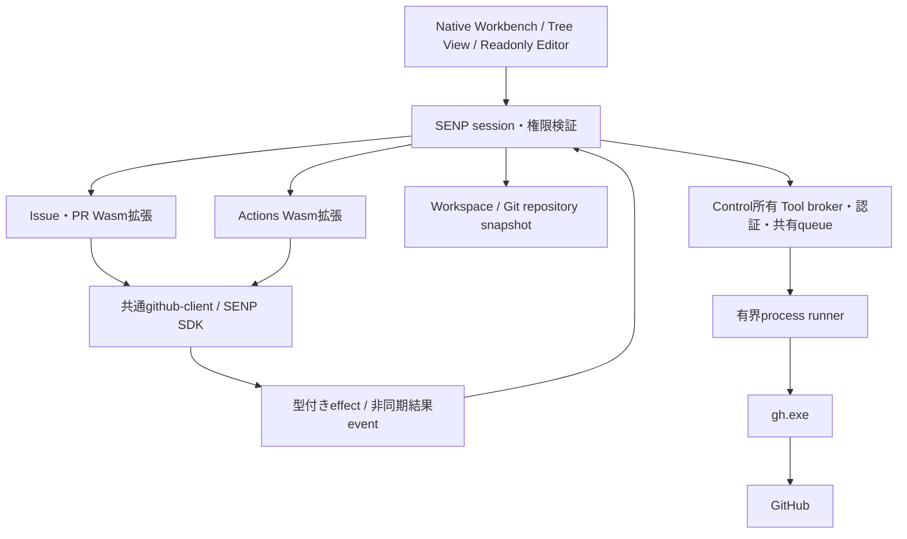

# SENP GitHub拡張 基本設計・API設計案

状態: G01/G02のschema・WIT・codec、G03a/G03bのsessionと実host、G04のowner lifecycle、
U01の複数View native pageとSCM共通header、U02のlazy Tree model/provider/native body、
U03のreadonly input登録と保持したnative surface切替、U04のMarkdown・metadata・table本文、
U05の有界text resourceとnative検索・コピーを実装済み。
page/commandの公開adapter、tool broker、GitHub拡張、v2 package受理は後続工程。
作成日: 2026-09-07。
調査対象: `5346511f26fa04cc13acdad21ff603b4813e6768` のチェックアウト。
追跡Issue: [#296 — Design SENP v2 GitHub Issues/PR and Actions extensions using gh](https://github.com/tsuyoshi-otake/sakura-editor-next/issues/296)。
詳細工程: [小さなコミットとTLA+/TLCの検証計画](senp-github-extensions-implementation-plan.md)。
形式検証: [有限モデル・反例・実行結果](formal/senp-github-models.md)。

関連: [SENP基盤 #251](https://github.com/tsuyoshi-otake/sakura-editor-next/issues/251)、
[process・integrity境界 #255](https://github.com/tsuyoshi-otake/sakura-editor-next/issues/255)、
[配布payload #260](https://github.com/tsuyoshi-otake/sakura-editor-next/issues/260)。

## 1. 到達点と採用案

SCMとは独立した2つのSENP拡張を用意する。Issue・PR用とActions用に
Activity Barのボタンを1つずつ追加し、どちらもPrimary Side Barを開く。
一覧から選んだIssue・PRの本文、Actionsのジョブ・ステップ・ログはアプリ内で読む。

本体には汎用のTree View、読み取り専用Editor、拡張コマンド、権限付きの
外部ツール利用契約を追加する。GitHubの一覧構成、データの解釈、詳細の組み立ては
Wasm拡張に置く。GitHubへの通信とOAuth認証はGitHub CLI (`gh`) を使う。
現在のSCMが`git.exe`を使う構成と、外部ツールを使う方針をそろえる。

初回の完成範囲は**閲覧**。コメント・編集・レビュー送信・マージ、Workflow実行・
再実行・キャンセルは別の書き込み能力として後続設計に分ける。
本文とログのアプリ内表示は初回の完成条件に含み、一覧だけの段階では完成扱いにしない。

| 拡張パッケージ案 | サイドバー | アプリ内の詳細 |
|---|---|---|
| `sakura-github-pull-requests` | Pull Requests / Issuesの2つのView、状態別の一覧 | タイトル、状態、作者、ラベル、Markdown本文、ページ単位のコメント。PRにはbase/head、draft/merged状態 |
| `sakura-github-actions` | Current Branch / Workflowsの2つのView。Workflow → Run → Attempt → Job | 実行概要、ジョブとステップの状態・所要時間、選択したジョブのログ |

共通の`github-client` Rustライブラリを両拡張に静的リンクする。
これは3つ目の常駐拡張ではなく、DTO変換・ページング・識別子・エラー解釈の共有コード。
認証情報、実行キュー、生レスポンスのキャッシュは本体の共通サービスが所有する。

最初の対象はWindows x64 MSBuild、github.com、既存のローカルFolder / Workspace。
GitHub Enterpriseはhostを含む識別子で拡張可能にするが、初回対応を宣言しない。
gh未導入・未対応バージョンでは理由を表示し、利用者が導入後に再検出できるようにする。
本体や拡張がghを自動ダウンロード・更新する仕組みは追加しない。

## 2. 現行コードで確認した制約

以下は実装済みの事実。以後のAPI名・型・配置は提案である。

| 境界 | 確認した現状 | 必要な変更 |
|---|---|---|
| [SENPパッケージ](../rust/senp/sakura_senp/src/lib.rs) | schema 1、未知フィールド拒否。runtime capabilityはvisibleText/decorations、activationはonStartupFinished | schema 2、別ABI、コマンド・View・ツール利用の検証 |
| [WIT](../rust/senp/wit/senp-extension.wit) / [Rust host](../rust/senp/sakura_senp_host/src/main.rs) | decoration専用の同期export。WASIなし、IPC最大4 MiB、呼び出しfuel/deadlineあり | 非同期I/Oを開始できるevent/effect契約。旧ABIは維持 |
| [Runtime](../sakura_core/senp/SenpRuntimeService.h) | 公開契約もindent decoration専用 | 汎用の拡張sessionを追加。描画側の非同期cacheを壊さない |
| [Workbench登録](../sakura_core/workbench/CWorkbenchRuntime.cpp) | integrity-pinned built-inのみ。`sakura.projects` providerだけ受理 | 拡張所有のTree Viewをhost providerと区別して登録 |
| [Contribution registry](../sakura_core/workbench/layout/WorkbenchContributionRegistry.h) | 起動時の1 batchのみ | owner単位の追加・削除とgeneration付きsnapshot |
| [Page registry](../sakura_core/workbench/viewcontainer/ViewContainerPageRegistry.h) | 1 containerに複数host Viewは未対応 | containerとViewのlifetimeを分離した汎用複数Viewページ |
| [SENP ID validator](../rust/senp/sakura_senp/src/lib.rs) | Workbench IDにコロンを許可しない | schema 2で`pr:github`等の正規IDを受理。パッケージIDの規則は別に維持 |
| [Editor](../sakura_core/workbench/editor/CLAUDE.md) | 純粋モデルとnative投影は別。nativeは1プロセス1 CEditDocという制約 | 読み取り専用input/surfaceの実アダプターが必要。既存編集内容を使い回さない |
| [Markdown](../sakura_core/markdown/CLAUDE.md) | native parser/renderer、raw HTMLやscriptを実行しない | 拡張提供の読取専用resourceを入力にできるadapter |
| [Git runner](../sakura_core/workbench/scm/GitCommandRunner.h) | shellなし、明示argv、上限・cancel・job objectを持つ | Git依存を外へ漏らさず、汎用の有界process runnerへ必要部分だけ抽出 |
| [Request基盤](../sakura_core/platform/request/CLAUDE.md) | WinHTTPのproxy/retry/credential契約 | ghは別のHTTP実装。設定・proxy・retryを継承したと偽らない |

[VS Code拡張互換機能の廃止方針](vscode-extension-compatibility-retirement.md)は維持する。
VSIX/Node/Open VSXの再導入ではなく、権限を限定したSENP/Wasm契約の追加である。
汎用APIであることは任意のOS操作や任意のプログラム起動を意味しない。

## 3. VS Codeとの対応とUI

ViewContainerとViewは、公式拡張のmanifestで確認した以下のIDを使う。
新しい物理Partを作らず、SCMのactive-tool状態とも結び付けない。

| 概念 | ID | 参照元 |
|---|---|---|
| Issue・PR container | `github-pull-requests` | [GitHub Pull Requests manifest](https://github.com/microsoft/vscode-pull-request-github/blob/6a438651b1062b17323c2c2f276eb89ab63535d2/package.json) |
| PR View / Issue View | `pr:github` / `issues:github` | 同上 |
| Actions container | `github-actions` | [GitHub Actions manifest](https://github.com/github/vscode-github-actions/blob/45e962b4439e6476d67937206566c0470743c660/package.json) |
| Actions View | `github-actions.current-branch` / `github-actions.workflows` | 同上 |

公式拡張のPR作成container、Notifications、Actions Settings等は今回の閲覧範囲に
含めない。登録したViewを空の無効プレースホルダーで代用しない。
未認証・対象なし・取得中・失敗は、実装したView自身のwelcome/status状態として表示する。

ツリーは[VS Code Tree View API](https://code.visualstudio.com/api/extension-guides/tree-view)の
getChildren/getTreeItem、安定ID、展開、選択、refreshという概念に従う。
Activity Bar → ViewContainer → 複数Viewの配置は
[Contribution Points](https://code.visualstudio.com/api/references/contribution-points#contributes.viewsContainers)を参照する。

選択するとEditor領域に読取専用の詳細inputを開く。同一resourceは既存inputを再利用し、
サイドバーを閉じても開いた詳細は残す。取得中も通常の編集・スクロール・切替を阻害しない。
Editorの未保存本文・undo・選択・scrollを保持したまま詳細を開いて戻れることを必須にする。
native adapterがこの条件を満たすまでは詳細Editorを実装済みとしない。
adapterは保持したlegacy編集surfaceと独立したreadonly surfaceを選択して投影し、
既存CEditDocへGitHub本文を代入しない。readonly inputは選択・検索・コピー・closeを提供し、
Save/Revertは型付きNotApplicableとする。別のGitHub本文に切り替えることを「編集」として
undo stackへ載せない。inputのrestoreはidentityだけを保存し、内容は再認証・再取得する。

U03では既存EditorCoreServiceのgroup内に最大16件のreadonly inputを登録する境界と、
保持したnative surfaceを切り替えるadapterを実装した。scope/resourceの同一性、inactive open、
Close/owner失効、CEditDoc/undo保持とnative選択/scroll/focusを`SenpReadonlyWorkbench.*`で検証する。
描画runnerの`ReadonlyEditors`はinput切替・resize・Editor Part非表示・surface移動を実画面で比較する。
Save Allは全working copyを扱うWorkbenchへ渡し、readonly inputの保存とは分ける。
U04は既存native Markdown previewのworkerへ構造化本文を接続し、metadata/tableを文字列のまま描画する。
script・command linkは実行せず、local/remote画像は権限未定義のためblockedにする。
U05は64 KiB chunk、32 MiB/resource、Control内64 MiBのmemory-only storeとnative readonly textを提供する。
UTF-8の継続decode、文字選択、検索、コピー、partial/失効を検証する。
アプリのtab/command/backup、text-section routingとsample公開はU06の完了条件に残す。

### 操作と情報状態

- PR/Issue: Openを初期filterとし、Closed / Merged等へ切り替え、明示操作で次ページを読む。
  一覧全件の本文・コメントを先読みしない。
- Actions: Current Branchは対象repositoryの実ブランチ。detached HEADではその旨を表示し、
  Workflows Viewは使える。Workflowを展開して実行を取得する。
- Runの`status`と`conclusion`は別の値。実行中でconclusionがnullなら成功にしない。
  未知のenumは原値を付けたUnknownとして扱う。
- 0件、読取権限なし、ネットワーク障害、取得前は区別する。
  成功後にrefreshが失敗した場合は旧snapshotと取得時刻を残して「更新できませんでした」と表示する。
- 手動refreshは表示中の範囲が対象。折り畳まれた全Workflowの全履歴を巡回しない。
- キーボード、focus、tooltip、UIA名、テーマ、DPI、View移動は既存Workbench契約に従う。
  Ctrl+B / Ctrl+J / Ctrl+Alt+Bは既存Part操作のまま。

### SCMを参照するサイドバーのデザイン

サイドバー内の各Viewは、既存の
[`CScmWorkbenchTool`](../sakura_core/workbench/scm/CScmWorkbenchTool.cpp)の
密度、余白、ヘッダー、選択状態、タイトルアクションを参照して設計する。
以下は調査とU01実装で確認した参照値。共有テーマとDPI変換を使い、
同じ役割の寸法・色を汎用View側に重複定義しない。抽出は表示primitiveに限定し、
Gitの状態・refresh worker・SCM resource groupをGitHub拡張へ持ち込まない。

| 要素 | SCMで確認した基準 | GitHub Viewへの適用 |
|---|---|---|
| Viewヘッダー | U01でSCMの旧30 DIPをVS Codeの22 DIPに統一。16 DIPの開閉アイコン、左右margin 2 DIP、11 DIPの大文字title | 共通`ViewPaneChrome`で開閉、タイトル、右寄せactionを同じ行に置く。長いタイトルはaction領域の手前で省略 |
| 一覧の密度 | repository/graph行22 DIP、行inset 10 DIP、icon 16 DIP | Issue/PR/Workflow/Run/Jobは一行の要約とし、主labelと補助descriptionを分ける。長い本文は詳細Editorに置く |
| 色と文字 | `CThemeService`、`ThemeFontKind::Chrome`、`palette.sideBar/primaryText/descriptionText/border` | 色・フォントをテーマから解決。セクション境界は既存の細線。独自のカードや影を足さない |
| hoverと選択 | hover/非focus選択は`palette.raised`、focus選択は`palette.accent/highlightText` | hover・選択・キーボードfocusを区別。更新後もstable item IDで選択を保持 |
| タイトルaction | SCMの右寄せtoolbar、tooltip、実行対象に応じたcommand | refresh・状態filter・repository選択を実動するcommandに結ぶ。ラベルとhit領域を重ねない |
| スクロール | [`COverlayScrollbar`](../sakura_core/workbench/controls/COverlayScrollbar.h)、テーマからの色解決、明示的wheel処理 | Viewごとのscroll位置を維持。thumb・wheel・keyboard・focus移動を検証 |
| 状態の意味 | welcome/statusと実データ行の分離 | 取得前・loading・0件・未認証・権限不足・失敗・古いsnapshotを明示。成功/失敗を色だけで伝えない |

SCMの見た目を参照しても、上記の公式ViewContainer/View IDとGitHubの情報構造を守る。
SCM側にもVS Codeとの差異が見つかった場合は、VS Codeの実動作を確認した上で
汎用表示の契約を決め、必要な差異をowning subsystemの`CLAUDE.md`に記録する。

U01/U02/U06では同一テーマ・DPI・サイドバー幅のSCMを横に並べて比較する。
100/150/200% DPI、Light/Dark/High Contrast、狭い幅と長いタイトル、hover/focus/選択、
折り畳み、resize、View移動を受入fixtureに含める。
描画の確認は[dual-capture手順](../.claude/skills/stale-pixel-verification/SKILL.md)で
画面上のpixelとPrintWindowを比較し、寸法・状態・アクセシビリティの確認を併用する。
U01では実native子windowによるcollapse、View/container移動、focus、UIA/MSAA、
3テーマ・3 DPIのdual-captureを検証した。bodyはstock EDITの保持状態を検査するfixtureで、
GitHub一覧・本文の実装済み画面ではない。SCMの実画面は変更前後とも全面再描画との差分0%。
SCM子surfaceのPrintWindow差分は変更前にも約6%あり、実画面の描画不良と区別して記録する。

記録する差異: nativeの読取専用Document APIはVS Code Webview APIではない。
任意HTML/JS/CSSを受け取らない。アイコンは現在のSENPのThemeIcon制約を継続する。
Actionsの公式SVGは未対応なので、対応する既存codiconによるSENP表現を使い、
その差異を実装時に[Workbench guidance](../sakura_core/workbench/CLAUDE.md)へ記録する。

## 4. 責務とプロセス配置



図の往復は通信の流れであり、静的依存の循環を許すものではない。
静的依存は`UI adapters → SENP contracts ← Wasm bindings`、
`composition → tool contracts ← gh provider → process contracts`。
GitHubのUIモデルをplatformへ持ち込まない。

| 所有者 | 責務 |
|---|---|
| Editorプロセス | native View/Input、workspaceと選択repository、拡張session、Wasm hostのlifetime |
| Wasm拡張 | Tree Item、Issue/PR/Actions DTO、API endpoint選択、filter、詳細Document構成、更新要求 |
| ControlのTool broker | capability照合、session/grant、gh認証、複数windowを横断するsingle-flight/cooldown、bounded response/text resource |
| gh provider | 許可された操作からargvへの変換、tokenを外へ出さない認証経路、HTTP envelope、process起動 |
| 共通UI renderer | Tree描画、Markdown、metadata/table、読取専用text、focus/scroll/UIA |
| 既存SCM/Git境界 | ローカルrepositoryの事実。Issue・PR・ActionsをSCMのresource groupとして保持しない |

Controlへの要求はEditorの自己申告だけで許可しない。profileのインストール済み
digest・enablement・承認済みcapabilityを信頼された管理経路で確認し、
IPC接続に束縛したopaque grantを発行する。Wasmがownerや権限を文字列で偽装しても無効。
認証にブラウザーを開く効果だけは、明示的に接続を開始したEditorへ戻す。

## 5. SENP v2契約

### 5.1 互換性とmanifest

schema 1 / `sakura:senp/extension@1.0.0`は現在のまま扱う。
schema 2 / `sakura:senp/extension@2.0.0`を追加し、別WIT world・明示的handshakeで選択する。
v1へv2フィールドを黙って追加せず、未対応アプリはinstall時にUnsupportedSchema/AbiMismatchで終端する。
既存の言語パッケージ・Indent Rainbow・Projectsを一括移行する必要はない。

G01時点: 既知のschema 2/ABI 2を判別した後、未実装のruntimeは
`UnsupportedRuntime`で拒否する。未知schemaは`UnsupportedSchema`、
schema 2にABI 1/未知ABI/異なるmoduleを組み合わせると`AbiMismatch`。
JSON全体の重複キー・末尾入力を検査してからversionを選び、pack・archive検証・
installed listingが同じ入口を使う。v2 packageの公開・インストール・寄与登録はまだ許可しない。

以下はv2の最小構成例。API名はこの提案の名前で、現行validatorでは受理されない。

```json
{
  "schemaVersion": 2,
  "id": "sakura-github-pull-requests",
  "publisher": "sakura.builtin",
  "displayName": "GitHub Issues and Pull Requests",
  "version": "0.1.0",
  "description": "Browse repository issues and pull requests.",
  "engines": { "sakura": ">=VERSION_WITH_SENP_V2" },
  "runtime": {
    "abi": "sakura:senp/extension@2.0.0",
    "module": "module/extension.wasm"
  },
  "activationEvents": ["onView:pr:github", "onView:issues:github"],
  "capabilities": [
    "workbench.views.tree", "workbench.documents.readonly",
    "workbench.commands", "workspace.repositories.read",
    "tools.github.repository.read"
  ],
  "contributes": {
    "viewsContainers": {
      "activitybar": [{
        "id": "github-pull-requests", "title": "GitHub",
        "icon": "$(github)", "order": 6
      }]
    },
    "views": {
      "github-pull-requests": [
        { "id": "pr:github", "name": "Pull Requests", "type": "tree", "order": 10 },
        { "id": "issues:github", "name": "Issues", "type": "tree", "order": 20 }
      ]
    }
  }
}
```

実装時に最低対応製品versionを確定し、例のplaceholderを置換する。
起動時は軽いcontribution metadataだけを登録し、表示・command・復元された詳細inputの
解決で初めてactivateする。`onCommand:<id>` / `onDocument:<type>`もv2で検証する。
コマンドはmanifest宣言とsession登録の双方が一致したものだけ実行可能。

任意のsigned/developer拡張も明示されたtrust/capabilityの範囲で同じTree/Document APIを使える。
標準IDの衝突はインストール順で奪い合わず、owner衝突の診断として拒否する。
製品予約Part IDは引き続き拡張登録不可。

### 5.2 UI契約

| 契約案 | データ・操作 | hostが守ること |
|---|---|---|
| `TreeDataProvider` | `getChildren(parent?, cursor?)`、`getTreeItem(id)`相当のrequest/event、変更通知 | itemのowner・stable ID、重複・循環・深さ・件数上限、古いrequestの破棄 |
| `TreeItem` | id、label、description、tooltip、ThemeIcon、collapsibleState、command | HTMLなし。commandはowner宣言済み、引数は型・サイズ検証 |
| `TreePage` | items、opaque nextCursor、revision、loaded/empty/error | 部分取得を全件と偽らない。展開・選択はnative側のstable ID状態 |
| `ReadonlyDocumentProvider` | resource、type、title、revision、sections | Markdown / metadata / table / text-resourceの固定union。HTML/JSなし |
| `TextResource` | 読取専用handle、長さ、状態、offset/lengthによるchunk read | 生パスを渡さずowner/grant/revisionを検証。解放・失効・総量上限 |
| `Commands` | 宣言、invoke、cancel、terminal result | UIとpaletteの同じroute。別ownerの任意commandやshellに転送しない |
| `WorkspaceRepositories` | workspace revision、root handle、branch、remotes、変更event | 現行のworkspace/Git authorityからimmutable snapshotを投影 |

Documentのidentityは`(profile, account, host, repository ID, kind, object ID, attempt)`。
display title、PID、HWND、一覧indexをidentityにしない。resource URIにtokenやsigned URLを含めない。
PRのbase/headが別forkでも、一覧・本文の取得先は選択したbase repositoryに固定する。
同じworking treeを開いた複数windowでもremote repository identityは共通になる。

Markdownは既存native parserを使い、拡張本文にはローカル画像rootを与えない。
remote画像は初回は自動取得しない。本文中の画像位置とリンクは残し、
private添付画像を読めたと偽らない。HTTPSリンクを開く明示操作はhostが検証する。
GitHub tokenをMarkdown rendererへ渡さない。ログのANSI/OSCは制御動作として実行しない。

### 5.3 非同期event/effect方式

Wasmtimeの同期exportの中でghやネットワークを待たない。
v2のexportは`activate(context) → effects`、`onEvent(event) → effects`、`deactivate(reason)`。
effectは`startToolRead`、`publishTreePage`、`publishDocument`、`completeCommand`、
`invalidateTree`等の有限union。I/Oをhostが開始し、完了を次のeventとして返す。
この方式なら現行のfuel/epoch制限を維持して、常駐async runtime/WASIを公開せずに済む。

全要求に`operationId`、owner generation、workspace revision、account generation、
resource request generationを付ける。表示先はこれらの一致を確認してから反映する。
wire envelopeにはprotocol versionとsequenceを付け、v1/v2を推測で判定しない。
同一ID・同一payloadの再送は同じ結果を返し、異なるpayloadの再使用はConflict。

G02のcodec/WITは実装済み。wireはUTF-8の厳密JSONで、固定recordの全memberを
必須とし、unionを`{"type":"caseName","data":{...}}`で表す。未知member/case、
重複キー、コメント、BOM、末尾カンマを拒否する。各envelopeは`protocol: 2`、
正の`sequence`と`sessionGeneration`を持つ。整数は両言語で正確に扱える
`0..INT64_MAX`、owner generationも正とする。account generationの0は未採用状態であり、
signed-outの判定には使わない。

v2では既存4 MiBのIPC上限より小さい1 MiB/frame・65,536 JSON nodesを適用する。
最大64 effects/batch、256 items/page、32 document sections、64 KiBのtool結果文字列、
256 KiBのMarkdown sectionとし、送信側にも集約上限を適用する。
[共通fixtureと往復手順](../rust/senp/fixtures/README.md)でcasing、Unicode、数値、
page状態とbatch内のread ID再使用を検査する。sequenceの順序・再送とackの所有は
G03aの[session実装](senp-v2-runtime.md)で検査する。G03bはWin32 processとの接続を担う。
WITや低位runtimeの存在だけでv2 packageを実行可能とはしない。

完了eventはackまで有界queueで保持する。満杯なら新規要求をBusyで拒否し、
未通知の完了を捨てない。host切断時は全pendingをHostUnavailableで終端し、
再接続は新generationとsnapshotから開始する。eventの際限ない再送はしない。

### 5.4 contributionの動的更新

install/enableは「package検証 → 新owner準備 → 全descriptor/page検証 → commit → layout reconcile」。
途中失敗で既存ownerを失わない。disable/uninstallはまずgrantを失効して新規仕事を止め、
in-flightをcancelし、commands/viewsをowner単位でdisposeする。
開いた読取専用inputはprovider unavailableを明示し、旧profile/accountの内容を消去する。
閉じる操作は常に使える。ユーザーの通常の編集中inputを巻き添えにしない。

Viewの折り畳み・Partの非表示・container移動はdisposeではない。
同じView instanceと選択/展開を保持し、非表示はpollingの購読だけを外す。
updateは新digestの検証・起動準備後にownerを置換する。失敗は旧版維持、
新たなcapabilityが必要な場合は承認待ちで旧権限を拡大しない。

G04は純粋catalogのowner候補とruntime/publication transactionを実装する。
publication adapterなしではUnsupportedとなりhostも起動しない。画面・command・grantの
具体的な投影はU01/U06/T02で接続する。SENPの初期範囲は自分またはproduct-owned containerで、
別extensionのcontainerはtyped Unsupportedとする。VS Codeのcross-provider保持と
container消失時のExplorer移動はnative page poolの未対応境界として記録し、黙って近似しない。
[ownerと回収の実装契約](senp-v2-runtime.md)。

## 6. GitHub CLI境界と認証

### 6.1 公開するのはtool serviceでありprocess実行権ではない

拡張が使う`ToolService`はtyped provider requestを受け取る。
初回providerは`github`のみで、`RepositoryRead`と`OpenConnectionUI`を提供する。
外部ツールのパス、argv、環境変数、cwd、stdinを拡張から自由入力させない。

`RepositoryRead`はgrant済みrepository handle、正規化した相対resource path、
小さいquery map、JSON/textの結果種別を受ける。gh providerが
`gh api --hostname <host> --method GET --include <endpoint>`へ変換する。
endpointはhostが`repos/<owner>/<repo>/`を付けて構築し、絶対URL、userinfo、`..`、
encoded separator、fragment、未知query、`@file`、GraphQL、任意headerは受け付けない。
JSON/text以外の巨大downloadは許可しない。read契約は選択repositoryの読取範囲を許可し、
Issue本文だけの権限であるとは表示しない。

hostが知るGitHub固有事項はCLIの認証・argv・HTTP境界・repositoryへのscope制約。
Issue/PR/Workflowの木構造やラベル色などは含まない。endpointからDTOへの変換は拡張側。
別ツールを追加する時は別のtyped providerを登録し、`run(anything)`には一般化しない。

実装上は`gh issue/pr/run ... --json`も候補になるが、初回の本線はRESTを`gh api`で呼ぶ。
HTTP status、Link、ETag、rate-limit情報を同じ形式で取り出せ、ページ単位の取得を制御できるため。
`gh api`はfieldを追加すると既定methodが変わるので、常に`--method GET`を指定する。
`--paginate`による全ページ自動取得、`--template`、任意`--jq`、`--verbose`は使わない。
[gh api manual](https://cli.github.com/manual/gh_api)

### 6.2 OAuthの所有者

サインインは`gh auth login --hostname github.com --web --skip-ssh-key`が所有する。
Sakura独自のOAuth App/client secret/refresh-token DBは作らず、VS Codeのclient IDも使わない。
ghを既に利用している場合は、ユーザーが接続を選ぶ時に既存アカウントを選択できる。
OAuthはghのブラウザー認可フローであり、Sakuraのpassword入力欄は作らない。
[gh auth login manual](https://cli.github.com/manual/gh_auth_login)

loginは専用の有限sessionで起動する。stdinを非TTYにして追加のGit/SSH設定promptを避け、
`--git-protocol`を指定しない。code/URLを含むghの実出力は接続用の一時表示領域へ流し、
英語の成功文の文字列一致を判定条件にしない。予期しない入力要求はUIの待機に放置せず
UnsupportedInteractiveFlowで終了させ、対応CLI版の案内を出す。
成功判定はprocess終了後の構造化auth確認と本人identityの照合。

確認には`gh auth status --hostname <host> --json hosts`を使う。
JSON modeは認証不備でもexit 0になり得るので、`state`、`login`、`active`、`tokenSource`を読む。
tokenはshowしない。network timeoutをsigned-outに変換しない。
[gh auth status manual](https://cli.github.com/manual/gh_auth_status)

接続状態は`Unknown / Checking / Disconnected / SigningIn / Connected /
ReauthenticationRequired / Unavailable`。最初のtoken欠如はCheckingの途中にあり得る。
不完全な初期snapshotから自動logout・再loginを開始しない。
接続UIを閉じる・cancel・期限切れ・拒否・host終了は全て有限の操作結果を返す。

| 接続操作の分岐 | 操作結果と安定した接続状態 |
|---|---|
| 既存認証の検証成功 / login後の本人照合成功 | Succeeded → Connected、新grantを発行 |
| 認証情報なしと確認 | AuthenticationRequired → Disconnected。ユーザー操作までloginしない |
| login拒否・cancel・code期限切れ | Cancelled / Failed → 旧Connectedを維持、旧接続なしならDisconnected |
| 検証中のnetwork timeout・gh未導入・未知CLI形式 | TimedOut / Unsupported → Unavailable。最後に確認したidentityは参考情報として保持 |
| 接続済みtokenが401、再評価でも無効と確認 | AuthenticationRequired → ReauthenticationRequired、grant停止 |
| 明示的な接続解除 | Succeeded → Disconnected、grant/cache失効 |
| 接続候補の切替中に失敗 | 新candidateを破棄し旧接続を維持。旧接続も無効ならReauthenticationRequired |

Checking/SigningInを最後の通知にしない。candidateが確定するまで現接続を上書きせず、
操作のterminalと利用可能な接続snapshotの両方を通知する。

### 6.3 アカウント固定と共有状態

接続は`(profile, gh設定元, host, login)`に束縛する。通常はそのhostのactive accountを初期候補とし、
複数accountは選択する。毎回`gh auth switch`してマシン全体のactive accountを変える実装は採らない。

選択accountの利用には、native認証provider内部だけで
`gh auth token --hostname <host> --user <login>`を有界private pipeで取得し、
一時的な子process環境の`GH_TOKEN`へ渡す。直後に`gh api user`でidentityを検証してからgrantを発行する。
user endpointはnative接続検証専用で、拡張のrepository-readには開放しない。
Wasm、一般IPC、argv、診断、OUTPUT、設定ファイルへtokenを出さない。
token取得自体は接続・再認証時のみで、一覧行ごとに繰り返さない。
[gh auth token manual](https://cli.github.com/manual/gh_auth_token)

外部の`gh auth switch`は既存のSakura接続を勝手に別accountへ変えない。
「接続を更新」で改めてaccountを選び、新generationへ移行する。
401では一度接続状態を再評価し、古い接続への無限retryをしない。
この方式はtokenをSakuraが一切扱わない方式ではない。永続保管はghに任せ、
native brokerだけが実行に必要な間保持する。

Sakura内の「接続解除」はgrantとcacheの消去であり、`gh auth logout`を実行しない。
端末全体の認証削除とはUI上も区別する。新規loginはghの共有設定にaccountを追加し得る。
この影響は接続画面に表示する。拡張disableやprofile切替で共有認証を消さない。

ghはOS資格情報ストアが使えない場合に平文設定へfallbackし得る。
`--insecure-storage`をSakuraから指定せず、tokenSourceの実値に基づく保管先表示を行う。
「必ずOSで暗号化される」とは説明しない。既存gh設定の無断削除や書換えによる修復はしない。
またOAuthの`repo` scopeは読取専用scopeではない。今回の読取制限はSENP tool境界の制限であり、
CLI token自体のGitHub権限を縮小した保証ではない。

### 6.4 process・環境・proxy

- 起動は検出済みの絶対`gh.exe`パスとargv。workspace内の同名exe、shell alias、
  gh extension、PowerShell/cmdによるコマンド文字列展開を許可しない。
- 子processの環境はhostが構築する。ambient token/GH_HOST/GH_REPO、debug、pager、browser overrideを
  そのまま継承しない。認証先・repository・tokenは接続に固定し、prompt/pager/update通知は抑制する。
- 例外は新規loginのブラウザー起動。ユーザー起点の許可済みURLだけを開く制約と、
  ghからの起動/代替URL表示の実挙動を対応CLI版で確認する。
- 既存Git runnerのprocess/pipe/job cleanupを小さなplatform部品へ抽出する。
  `-C`やPassiveRepositoryReadなどGit固有policyはGit adapterに残す。SCM全体の再設計はしない。
- ghのnetworkはWinHTTPではない。初回はgh/Goが扱う明示proxy環境とOS信頼基盤の
  対応範囲を検証し、PACやSakuraのhttp設定との完全同値は約束しない。
  ghが必要なproxy条件を満たせない場合はProxyUnsupportedで終了し、TLS検証を緩めない。
- job objectへの原子的所属、standard streamのみのhandle継承、stdout/stderrの同時drain、
  一つのmonotonic deadline、キャンセル時の子孫終了を共通runnerが所有する。

調査環境は`gh 2.93.0 (2026-05-27)`。この版でまずcontract fixtureを固定し、
対応範囲は実測で広げる。将来の全versionを無検証で互換と判定しない。
参考実装は[cli/cli v2.93.0](https://github.com/cli/cli/tree/v2.93.0)。

## 7. repositoryとGitHubデータの契約

repositoryはViewの選択で明示し、SCM画面を開いている必要はない。
Workspace/Gitのsnapshot adapterはSCM UIのHWNDやrefresh workerに依存させない。
既存モデルにremote情報が不足する場合は、そのadapterの有界passive Git readで補う。
重複workspace rootはcanonical pathでまとめ、worktreeはlocal identityを保持する。

remote候補は既存選択を優先し、1つなら選択、複数の異なるGitHub repositoryなら選択UIを出す。
`origin`、`upstream`という名前だけで用途を決めず、forkから親への暗黙fallbackは行わない。
URLのowner/repo/hostを解析し、APIでrepository IDとcanonical full_nameを確認する。
SSH aliasはgithub.comと推測せず、未解決候補として明示指定を求める。
非GitHub、対象repositoryなし、複数root、remote削除を別の状態にする。

### API対応表

全て明示的host・repository付きの`gh api --method GET`。パスの組立とquery検証はbroker、
endpoint選択・responseのJSON解釈は拡張SDKが担当する。

| 用途 | repositoryに続くpath | 取得方針 |
|---|---|---|
| Issue一覧 | `issues` | state/sort/direction/per_page/page。`pull_request`を持つ要素はIssue一覧から除外 |
| Issue本文・コメント | `issues/{number}` / `issues/{number}/comments` | 選択後。コメントは別page |
| PR一覧・本文 | `pulls` / `pulls/{number}` | state、draft、merged状態、base/headを別に保持 |
| PR会話コメント | `issues/{number}/comments` | 通常コメントを表示。レビューtimeline全対応は後続 |
| Workflow一覧 | `actions/workflows` | disabled状態を保持。runがなくてもWorkflowは存在する |
| Run一覧 | `actions/runs` / `actions/workflows/{workflow_id}/runs` | branch/workflow filter、ページ単位 |
| Run / Attempt | `actions/runs/{run_id}` / `actions/runs/{run_id}/attempts/{attempt}` | run IDとattemptを別キーにする |
| Job/Step | `actions/runs/{run_id}/attempts/{attempt}/jobs` | 特定attemptのページ。matrix job名の同一性を仮定しない |
| Jobログ | `actions/jobs/{job_id}/logs` | 選択jobのみ。text resourceへ有界転送 |

IssueページがPRだけだった時も「Issueなし」で全探索を終わらせない。
next pageを保持して「次を読み込む」を出す。filterの結果0件と全体0件を区別する。
API versionは初回`2022-11-28`を明示し、[API versionの方針](https://docs.github.com/en/rest/about-the-rest-api/api-versions)
に従ってfixtureを更新してから変更する。未知response fieldは許容し、必須fieldの型不整合はParseError。

### Actionsのログで約束する範囲

JobログAPIは短命のredirect先からplain textを取得する契約。
ghを通じて取得し、signed URLは保存・表示せず、tokenの別host転送が起きないことをfixtureで検証する。
[Workflow jobs API](https://docs.github.com/en/rest/actions/workflow-jobs#download-job-logs-for-a-workflow-run)

run全体のZIPを先に落として展開する方式は使わない。選択job単位の取得とし、
stdoutを段階的にTextResourceへ渡す。転送の部分成功を「全ログ」と表示しない。
実行中にまだ取得できない場合は`NotAvailableYet`とし、終了/再取得で更新する。
HTTP 404だけでは未生成・権限不足・削除を断定できないため、曖昧なら
`UnavailableOrNotFound`とする。期限切れと確認できた場合のみ`Expired`。

Stepの一覧と状態はJobs APIの`steps`が根拠。
ログ行とStepの対応を常に完全に復元できるとは約束しない。
確定できない行はジョブログとして読めるように残し、架空のStepへ割り当てない。
`gh run view --log`にもUNKNOWN STEP等の制約がある。
[gh run view manual](https://cli.github.com/manual/gh_run_view)

## 8. 負荷、キャッシュ、終端とcleanup

### 制限の初期値案

以下は製品の性能実測値ではなく、テストで固定する初期budget。

| 対象 | 初期値案 |
|---|---|
| gh process | Control全体2本まで、同じhost/accountのAPI readは1本。loginも総数に含む |
| 待機要求 | 全体64、拡張ownerごと16。上限はBusy、UI入力threadを待たせない |
| 通常要求 / ログ / login | queue待ち・retry込み30秒 / 120秒 / 10分 |
| JSON / stderr / IPC frame | 1応答4 MiB / 64 KiB / 4 MiB。header・envelope分も上限内 |
| TextResource | 64 KiB chunk、1job 32 MiB、Control全体64 MiB。初回はmemoryのみ |
| Tree | 1page 50項目、1View 2,000項目、深さ16。上限時は明示的に絞込みへ誘導 |
| host/session | v2 host最大4、ownerごと1。非表示で未使用のhostを停止し、使用中ならBusy |
| Wasm | 1call 200 ms/fuel制限、memory 64 MiBを初期値。DTO検証後の取り込みもbudget内 |
| gh子processのmemory | 1job 256 MiB、同時総量512 MiBを初期値。内部bufferにも上限を掛け、超過はResourceLimitExceeded |
| 応答cache | Control全体32 MiBのLRU、JSONのみ。private本文・ログを初回は永続化しない |

cache keyは`profile / 接続account generation / host / repository ID /
path / query / API version`。別profile・account・権限scopeへ流用しない。
同じreadへの複数subscriberはsingle-flightで集約し、最後のsubscriberが外れた時だけcancelする。
grant検証はcache hitにも適用する。bodyがないETagだけで304を成功扱いにしない。
ghが304をnonzero exitで返す場合も、HTTP envelopeが妥当で同じcache bodyがあればNotModifiedに正規化する。

更新は可視購読に基づく。Issue/PRとWorkflow一覧は手動または60秒、可視の進行中Run/Jobは15秒。
同じresourceの複数windowはbrokerで一つのpoll leaseを共有する。
完了Runは自動poll終了、Viewが隠れたら解除、開いている可視詳細だけは別leaseを保つ。
これらは要求頻度の上限であり、account queueやrate limitが優先する。

Retryはbrokerだけが所有し、拡張のrefreshとgh内部retryが重なって増幅しないことを
対応CLI版のfixtureで確認する。通常readは最大2attempt、指数backoff+jitter、deadline超過は終端。
403を一律rate-limitや未認証にしない。429/403のrate情報からRetry-After/resetを読み、
期限が長い場合はRateLimited(nextAllowedAt)で現在の要求を終端する。
rate情報不明のsecondary limitは最低60秒待機からbackoffする。
自動pollと手動refreshの双方がControlのhost/account cooldownを尊重する。
[GitHub REST best practices](https://docs.github.com/en/rest/using-the-rest-api/best-practices-for-using-the-rest-api)

可視repository数をR、展開された一意なresource数をU、読んだpayload総量をBとすると、
一覧の取得・変換はO(U + B)、window数Wの重複pollをそのままO(W×U)にしない。
Tree再描画はvisible rowに限定し、ログはO(B)の逐次decode/index構築、毎chunkの全文再parseはしない。
多repositoryでも最初から全run×全jobを探索しないことが主要な負荷削減になる。

### 要求の状態と所有者

```text
Accepted -> Queued -> Running -> (RetryWait -> Queued) -> Terminal
    |          |         |              |
    +----------+---------+--------------+--> Cancelled / TimedOut / OwnerDisposed
```

Terminalは`Succeeded / NotModified / Rejected / Busy / Failed / Cancelled /
TimedOut / OutputLimitExceeded / AuthenticationRequired / PermissionDenied /
RateLimited / UnavailableOrNotFound / Unsupported / ResourceLimitExceeded / OwnerDisposed`のいずれか1回。
`NotAvailableYet`や`Expired`などのGitHub固有の理由はterminalに付随するprovider reason。
UIの継続的な接続状態や表示状態とは別に、要求そのものは必ず終端する。
partial textを残す場合は結果に`complete=false`と取得済みbytesを付ける。
表示を継続できることと要求がまだ実行中であることを混同しない。

| 分岐 | finalization ownerと観測結果 |
|---|---|
| 正常終了・nonzero exit | process runnerがexitと両pipe EOFを確認しbrokerがterminalをpublish |
| cancel/deadline/output上限 | runnerがjob treeを停止・drainし、resourceをpartial/closedに確定してterminal |
| View非表示 | Viewが購読解除。最後のsubscriberならbrokerがcancel。保持Treeはdisposeしない |
| extension crash/disable | runtimeがgenerationを失効、brokerがowner要求を終端、nativeがunavailableを表示 |
| account/profile/repository切替 | 旧grant失効、cache/resource破棄、旧応答を拒否、新contextでのみ要求開始 |
| IPC切断・Editor終了 | Controlが接続ownerを失効。他windowのsubscriberは継続。無主の仕事は停止 |
| Control終了 | 全grant停止、全jobを終了、worker回収後に終了。再起動は新generation |
| cleanupが時間内に完了しない | 有界retirement ownerに所有権を保持し診断。detachして成功扱いにしない |

## 9. 実装順序と変更候補

各段階は縦に動くものを作る。Issueで追跡し、最後の閲覧シナリオまで完了して初めて機能完成。
この設計をfork側の追跡Issueに登録し、実装開始前に設計とrubricを基準として固定する。
製品実装に先立ち、詳細工程とTLA+/TLCモデルを検証して小さくcommitする。
commitはユーザー指示に従いmainで行い、pushは別途指示がある場合だけ行う。

| 段階 | 実装するもの | 次へ進める条件 |
|---|---|---|
| P0 契約を確定 | schema 2/WIT/event DTO、標準ID、budget、read-only境界、fake gh | cross-language fixtureが往復し、拒否・timeout・cancelを区別できる |
| P1 汎用表示の縦切り | GitHubに依存しないsample拡張で2 View、command、Markdown/text Editor、live dispose | 編集中の本文を保持して詳細を開いて戻る。native UIとデータの両方が合格 |
| P2 Tool/認証 | runner抽出、Control broker、account固定、login、read、header/chunk、rate-limit | 複数window、権限、cleanup、認証失敗をfakeで証明。SCMの既存テストも合格 |
| P3 Issue・PR拡張 | repository選択、一覧、本文、コメント、filter/page | 実リポジトリで本文までアプリ内表示。Actionsがなくても単独動作 |
| P4 Actions拡張 | Workflow/Run/Attempt/Job、Step状態、jobログ、可視poll | 失敗・進行中・再実行・未生成・大きいログを正確に扱い単独動作 |
| P5 配布・回帰 | 独立install/enable/disable/update、旧SENP回帰、Build/CI/docs | 総合rubric合格。未対応platformは明示Unavailableで副作用0 |

コード配置は実装時に既存component manifestへ合わせて確定する。
以下は責務の候補であり、現行に存在するAPI/ディレクトリとは限らない。

| 配置案 | 所有するもの |
|---|---|
| `rust/senp/wit/`、`sakura_senp`、`sakura_senp_host` | v2 schema/WIT、検証、bounded dispatch |
| `rust/senp/senp_sdk/`、`rust/senp/github_client/` | 拡張共通binding、GitHub DTO変換 |
| `rust/senp/extensions/sakura_github_pull_requests/`、`sakura_github_actions/` | 独立manifest/Wasm/README/LICENSE |
| `sakura_core/senp/` | runtime owner、grant/lifecycle adapter |
| `sakura_core/workbench/viewcontainer/`、新`tree/` | container内の複数View、汎用Tree projection |
| `sakura_core/workbench/editor/`、`sakura_core/markdown/` | native read-only input/renderer integration |
| `sakura_core/platform/process/`、新`platform/tools/` | process primitive、tool contract/broker、gh adapter |
| `sakura_core/platform/controlipc/`、`_main/` | ControlとEditorのcomposition/IPC |
| `src/main/modules/modules.json`、MSBuild/CMake、SENP targets | ownership/dependency/lockfile/埋込packageの投影 |

GitHub packageは独立インストール可能なfirst-party同梱catalog候補とし、
初期自動installはしない案。利用者が入れた2つだけのボタンを出す。
新規依存は必要性を個別に判断し、最低公開後7日、lockfile、CI auditを維持する。
本設計段階では依存を追加・更新しない。

## 10. 検証rubric

設計時の確認と、実装後の受入条件を分ける。
後者に書いた新suite名は実装予定であり、現在存在する・既に合格したという意味ではない。

### 設計時に実行する確認

- **D1 出典と変更境界**
  Verify: `git diff --check`、`git status --short`、本書の相対リンク先を存在確認。
  Expect: whitespace errorと壊れたlocal linkが0、今回の変更は本書だけ。
- **D2 Workbench識別子**
  Verify: `gh api repos/microsoft/vscode-pull-request-github/contents/package.json?ref=6a438651b1062b17323c2c2f276eb89ab63535d2`
  とActionsの上記固定refを取得し、`contributes.viewsContainers` / `contributes.views`を比較。
  Expect: 第3節の6つのcontainer/view IDが一致。SCM/Part IDの転用なし。
- **D3 gh依存契約**
  Verify: `gh --version`、`gh auth login --help`、`gh auth status --help`、
  `gh auth token --help`、`gh api --help`、`gh run view --help`と公式文書を確認。
  Expect: 使用flagが存在し、JSON exit 0・平文保管fallback・ログ帰属制約を設計で扱っている。

### 実装後に実行する受入条件

P0で下記filterに対応するfixture/runnerを実装し、runnerの存在だけでなくテスト件数>0を確認する。
GoogleTestは該当configurationの`build-sln.bat x64 Debug`成功後に実行する。
全コマンドは有界runnerで実行し、テスト後にrepositoryと起動PIDを照合して親→子の順で残存確認する。
既存ユーザーのghやeditorを無差別に終了しない。

| ID | Verify | Expect |
|---|---|---|
| V1 v1/v2互換 | `cargo test --manifest-path rust/senp/Cargo.toml --locked -p sakura-senp -p sakura-senp-host` | 既存v1、v2 fixture、コロンID、未知ABI/capability、digest不一致、camelCaseの全ケース合格 |
| V2 lifecycle | `tests1.exe --gtest_filter=SenpViewLifecycle.*:SenpEffectProtocol.*` | activate/cancel/disable/update/crash/reconnectでterminal漏れ0、旧generation反映0、owner残存0 |
| V3 実表示 | isolated UI fixture `SenpReadonlyWorkbench.*`でsample拡張の2 Viewと詳細を開き、編集へ戻る | View独立、selection/focus維持、dirty/undo不変、Markdown/textが実際に表示される |
| V4 gh起動 | `tests1.exe --gtest_filter=GhToolPolicy.*:BoundedProcessRunner.*:GitCommandRunner.*` | shell/任意argv/別repo/環境注入の拒否、SCM無回帰、pipe飽和・timeout・cancelで子孫残存0 |
| V5 認証 | `tests1.exe --gtest_filter=GhConnectionLifecycle.*`、fake ghでaccount A/B、JSON exit 0+error、timeout、401、login cancelを注入 | account混在0、自動logout/relogin loop0、共有gh設定の不要変更0、一般出力/IPCのtoken0 |
| V6 Issue・PR | 新拡張crateの`cargo test --locked`、PRだけのIssue page・コメント2page・必須field欠落をfixture入力 | Issue/PR混在0、本文保持、next pageの欠落0、ParseErrorをemptyにしない |
| V7 Actions | 新拡張crateの`cargo test --locked`、attempt 1/2、同名matrix jobs、未知status、null conclusionを入力 | run/attempt/job混線0、進行中を成功扱い0、全Step状態を元データから表示 |
| V8 ログ | `tests1.exe --gtest_filter=GhLogResource.*`、chunk境界UTF-8、32 MiB超過、302、404、途中cancel、OSCを注入 | 上限・partial明示、失効handle拒否、URL/token漏えい0、OSC副作用0、unknown Stepを捏造しない |
| V9 load/rate | `tests1.exe --gtest_filter=GhReadScheduler.*`、fake clockで5window×2拡張、429/Retry-After、403、304、64queue上限 | accountあたり1本、同一read1本、cooldown中0dispatch、hiddenの0poll、cache scope漏えい0 |
| V10 権限破棄 | `tests1.exe --gtest_filter=SenpToolGrants.*`、profile切替・digest更新・disable・接続解除後に旧handleで読む | 旧grant/cache/textへのアクセス0、新規権限の暗黙取得0 |
| V11 native pixel | P1/P5で[dual-capture手順](../.claude/skills/stale-pixel-verification/SKILL.md)に従いresize、移動、開閉、DPI/theme、focusを試行 | CopyFromScreen/PrintWindowの差が定義済みnoise floor内、古い座標の描画残り0 |
| V12 実環境 | opt-inで選択済みforkに対してreadonlyシナリオ。例: `gh api --hostname github.com --method GET repos/tsuyoshi-otake/sakura-editor-next/actions/workflows`とUI結果を比較 | Issue/PR本文、Workflow→Job→ログをアプリ内で確認。remoteへの書込み0 |
| V13 配布回帰 | x64 Debug/Release solution、変更したCMake共通contract、既存SENP package検証、encoding check、lockfile audit | 旧機能無回帰、必要resource同梱、未対応backendは明示Unavailable。runner/helper残存0 |

V11は現行skillを実際のUI変更時に全文読んで実施する。
本書だけの変更では画面検証やアプリbuildを実施したとは報告しない。

## 11. 実装前に固定する残りの判断

採用方針は「SENP v2 + gh + 読取専用 + 2つの独立拡張」。以下はP0/P1で実測して確定する。

1. native read-only inputを、1 CEditDoc制約下で編集状態を保持して開く具体的adapter。
   ここがUI側の最も大きい未実装境界であり、GitHub拡張より先に縦切りで証明する。
2. ghの対応version範囲、非TTY loginのcode表示/ブラウザー起動、jobログredirect、
   network retry、proxy条件。fake testに加え、配布対象版のopt-in試験で契約を固定する。
3. package管理のprofile authorityからControlへgrantを発行する経路。
   現在のEditor所有managementをそのまま信用するwire設計にしない。
4. budgetの妥当性。代表的な大規模repositoryと長いjobログで実測し、上限を無制限にする変更はしない。

OAuthアプリ登録、Webview runtime、任意process実行、GitHub書込操作は、
これらの判断を埋めるための暗黙の前提にしない。
